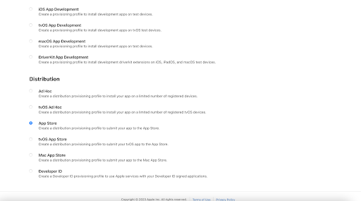

### Публикация в _App Store Connect_

#### Медиафайлы для Apple:

1. Иконка файл не должен содержать слои или закругленные углы - App Store самостоятельно приводит исходные файлы в нужный вид
2. Скрины Для iPhone разрешение (1334×750 пикселей).
   Разрешение для iPad (1536 x 2048 пикселей).
   Формат JPG и PNG, без альфа-канала.
   Создавать скриншоты разных размеров под каждый отдельный девайс не нужно. [Актуальные требования к скринам приложения](https://help.apple.com/app-store-connect/?lang=en/#/devd274dd925).
3. Название до 23 символов.
   Не должно включать упоминания других платформ или компаний: “Также вы можете загрузить приложение на Android” или “Мы также хороши, как Instagram”
4. Описание приложения до 4000 символов учитывая пробелы.
5. Поле ключевых слов 100 символов (с запятыми).
   Именно поле ключевых слов приводит пользователя из поиска к приложению.

   #### Публикация

[Обучающее видео](https://www.youtube.com/watch?v=bOEOrZ0SxL0)

1. Для начала у вас должен быть ключ need a Certificate Signing Request (CSR) file from your Mac. Если нет нужно создать:

   - Зайти в приложение Keychain: 
     
   - Сгенерировать ключ: 
     
   - Ввести любую почту: 
     

2. Создать distribution certificates Роли с которыми можно создавать сертификат [distribution certificates](https://www.youtube.com/watch?v=WeLsQqFGGQw):
   

   

3. Вкладка identifiers 

   

   
   Ввести описание и бандл айди. Если надо выбрать Capabilities

   

4. [Как создать distribution provisioning profiles](https://www.youtube.com/watch?v=5KJ2Rxndzyo)

   

   

Создание сертификата

