# Autodeploy с использованием GitHub Actions

## Получение token для deploy

1. Открыть настройки аккаунта на сайте [GitHub](https://github.com).

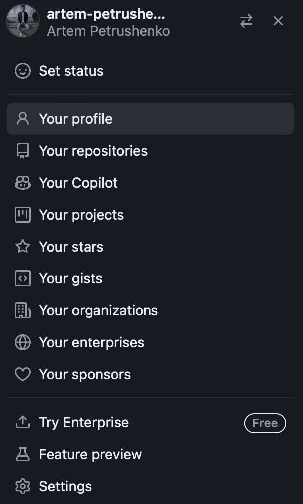

2. Найти пункт *"Development settings"* в левой навигационной панели.

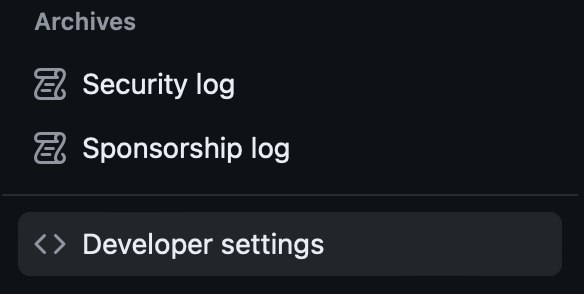

3. В появившимся окне, в левой навигационной панели необходимо найти *"Personal access tokens"*. Выбрать *"tokens (
   classic)"*.

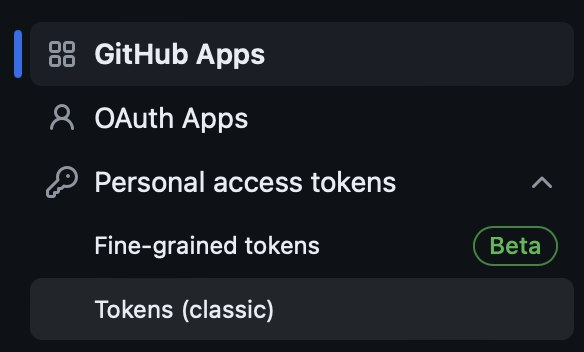

4. В выбранном разделе нажать на кнопку *"Generate new token"*, выбрать пункт *"Generate new token (classic)"*.

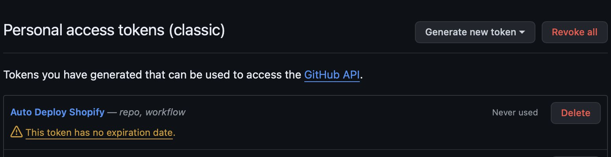

5. В появившимся окне заполняем пункт *"Note"*. Выбираем время, через которое token сгорит и в разделе *"Select scopes"*
   выбрать следующие пункты:

- *"Repo"*;
- *"Workflow"*.

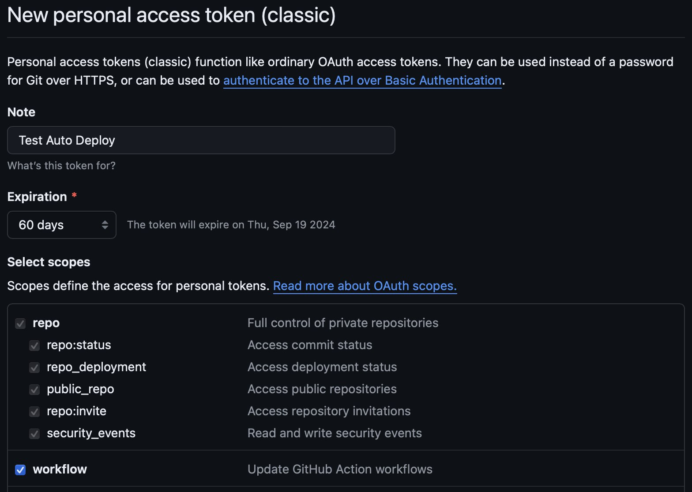

6. Нажимаем кнопку *"Generate token"*. Нас перекидывает назад на страницу с отображенным кодом. Его необходимо сохранить
   для дальнейшей работы с ним.

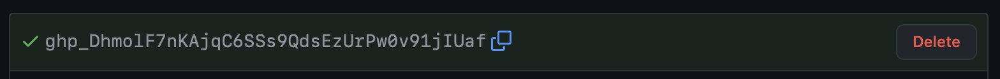

## Добавление ключа в репозиторий GitHub

1. Открываем **GitHub** репозиторий, к которому необходимо добавить автоматическое создание build-ов.

2. В разделе *"Setting"* необходимо найти раздел *"Security"*, в котором выбрать *"Secrets and variables"*. В выпавшем
   списке перейти в *"Actions"*.

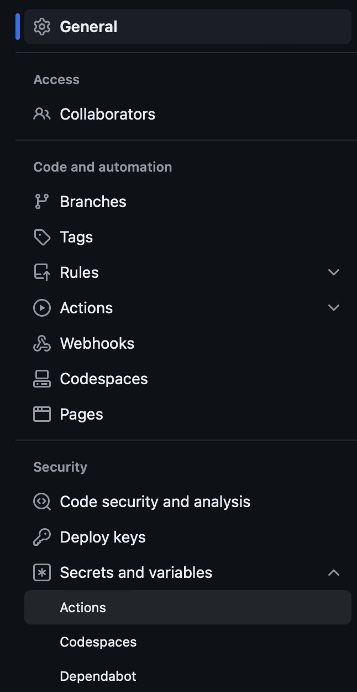

3. В разделе *"Secrets"* нажать на кнопку *"New repository secret"*.

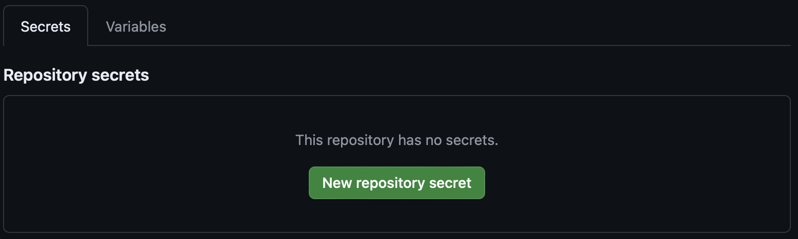

4. В появившемся окне необходимо ввести имя ключа, по которому будем обращаться и сам ключ, который был получен ранее.

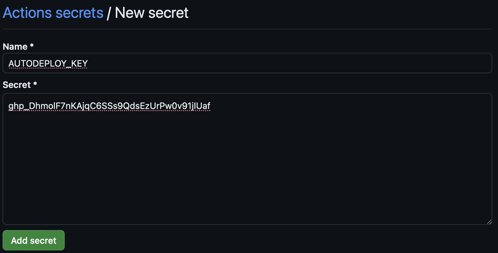

5. Нажимаем кнопку *"Add secret"*.

## Добавление скрипта для Autodeploy в репозиторий проекта

1. В корневой папке проекта необходимо создать папку *".github"*. В нее необходимо добавить папку *"Workflows"* и файл с
   расширением *".yaml"*.

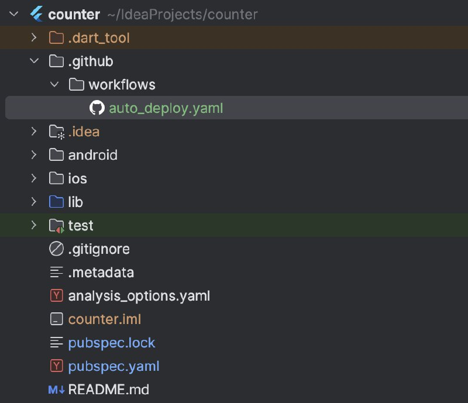

2. Скрипт состоит из таких частей:

- условие, на которое срабатывает скрипт;

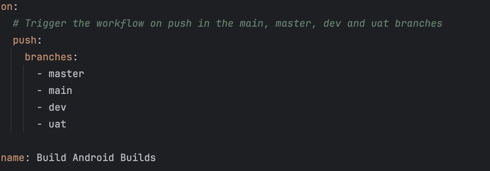

- название скрипта (в дальнейшем можно использовать, как фильтр);

- логика скрипта состоит из следующих частей:

a) получение версионности проекта;

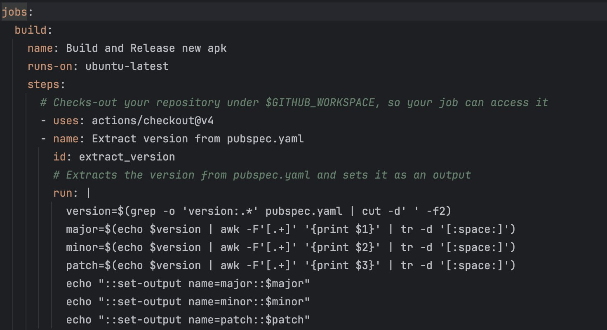

b) установка зависимостей;

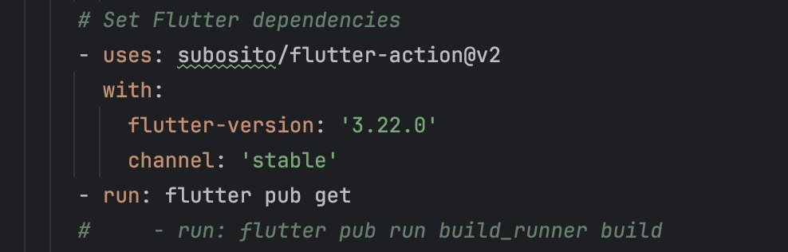

c) запуск тестов;

d) сборка *.apk* и .*aab*;

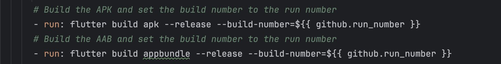

e) публикация полученных build-ов в репозиторий проекта, с использованием ранее созданного ключа.

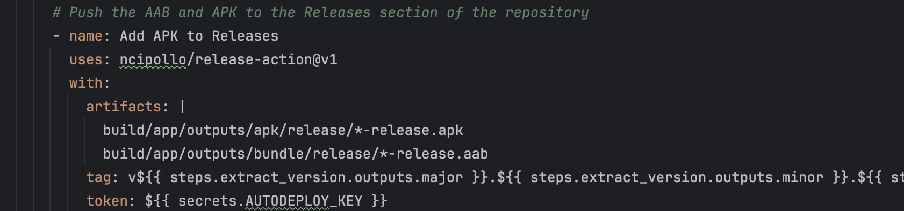

3. Чтобы увидеть процесс сборки необходимо на странице репозитория в **GitHub** перейти в раздел *"Actions"*. Тут можно
   увидеть ранее запущенные *"Workflow"* и их статусы.

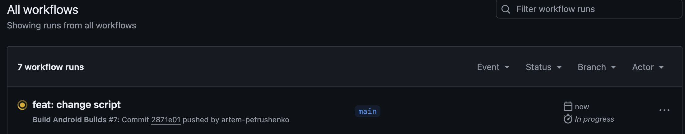

4. Полученные результаты находятся в разделе *"Releases"*.

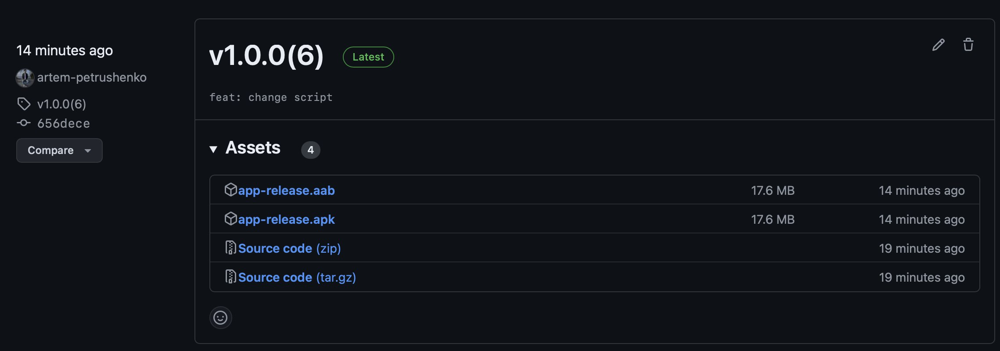
