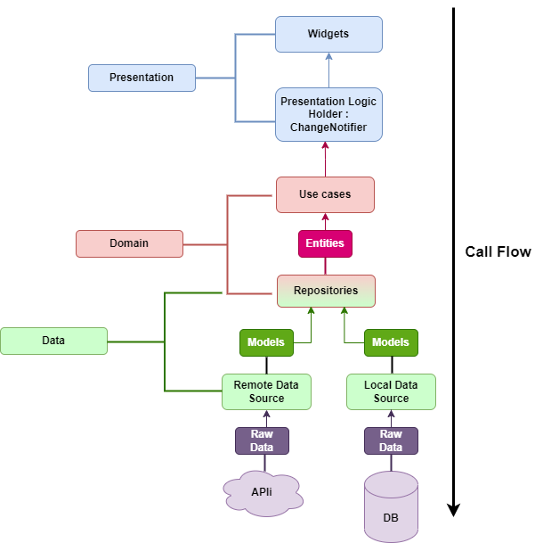

# Чистая архитектура

## Введение

При разработке мы всегда должны опираться на простые принципы, которые в дальнейшем должны нам помочь, а не усложнить
нам поддержку и расширение программного обеспечения. Для этого нам необходимо опираться на такие вещи, как:

- **SOLID** - пять базовых принципов объектно-ориентированного программирования и проектирования, которые дают нам
  возможность создавать гибкий и легко поддерживаемый код.
- **KISS** - принцип проектирования, который гласит, что большинство систем должны быть максимально простыми и
  понятными.
- **DRY** - принцип разработки программного обеспечения, направленный на уменьшение повторения информации различного
  рода.

Для визуализации архитектуры можно использовать следующую диаграмму:



Данная диаграмма представляет собой общую структуру чистой архитектуры. Состоит она из следующих слоев:

- **Ядро** - это самое важное и ценное в приложении. Ядро содержит в себе данные для работы приложения, такие как доступ
  к базе данных, сети, локальные данные и т.д.
- **Дата** - слой, который отвечает за получение данных из различных источников. Состоит из следующих подкатегорий:
    - **Data Source** - классы, которые отвечают за получение данных из различных источников, таких как база данных,
      сеть, локальные данные и т.д. В этом слое не должно быть никакой бизнес-логики. Далее, полученные данные он
      преобразует в модели данных, через которые он передает их в слой Repository.
    - **Repository** - классы, которые отвечают за получение данных из слоя **Data Source** и передачу их в слой
      **Use Case**. Является реализацией интерфейса, который определяет методы для получения данных в слое **Domain**.
      Имеет доступ к интерфейсам **Data Source**.
- **Domain** - слой, отвечает за связь между слоями **Data** и **Presentation**. Содержит в себе два основных элемента:
    - **Use Case** - классы, которые отвечают за получение данных из **Repository**. Они получают данные из слоя
      **Repository** и в случае необходимости их обрабатывают. После обработки данных они передают их в слой
      **Presentation** в виде **Entity**.
    - **Repository Interface** - интерфейсы, которые определяют методы для получения данных в слое **Domain**. Имеют
      доступ к интерфейсам **Repository**.
- **Представление** - слой, отвечает за отображение данных пользователю. Содержит в себе два основных элемента:
    - **Presentation Logic Holder** - классы, которые отвечают за получение данных из **Use Case**. Они получают данные
      из слоя **Use Case** и передают их в **Widget**. В случае необходимости они могут обрабатывать данные перед их
      передачей в **Widget**.
    - **Widget** - классы, которые отвечают за отображение данных пользователю. Они получают данные из слоя **
      Presentation Logic Holder** и отображают их пользователю.

Поток данных в чистой архитектуре выглядит следующим образом:
`Widget -> Presentation Logic Holder -> Use Case -> Repository -> Data Source`
Где поток данных является реакцией на действия пользователя. Чтобы понять, как это работает необходимо рассмотреть под
другим углом, со стороны кода.

## Структура проекта

Структура проекта в чистой архитектуре должна быть следующей:

```
├── lib
│   ├── common
│   ├── core
│   │   ├── api
│   │   ├── router
│   │   ├── themes
│   │   ├── usecases
│   │   └── utils
│   ├── features
│   │   ├── feature-1
│   │   │   ├── data
│   │   │   │   ├── models
│   │   │   │   └── repositories
│   │   │   ├── domain
│   │   │   │   ├── entities
│   │   │   │   ├── repositories
│   │   │   │   └── use_cases
│   │   │   └── presentation
│   │   │       ├── blocs
│   │   │       ├── pages
│   │   │       └── widgets
│   │   └── feature-2
│   │       ├── data
│   │       │   ├── models
│   │       │   └── repositories
│   │       ├── domain
│   │       │   ├── entities
│   │       │   ├── repositories
│   │       │   └── use_cases
│   │       └── presentation
│   │           ├── blocs
│   │           ├── pages
│   │           └── widgets
│   ├── injector.dart
│   └── main.dart
├── pubspec.lock
└── pubspec.yaml
```

- **common** - папка, которая содержит в себе общие классы, необходимые для ускорения разработки и уменьшения
  дублирования кода. Например, виджеты, которые используются в разных частях приложения.
- **core** - папка, которая содержит в себе базовые классы, необходимые для работы приложения. Например, классы для
  работы с сетью, базой данных, темами и навигацией, т.д.
- **feature** - папка, которая содержит в себе отдельные части приложения. Каждая часть приложения должна быть
  разделена на три основных слоя: **data**, **domain** и **presentation** и отвечать за свою часть работы.
- **injector.dart** - файл, который содержит в себе настройки для внедрения зависимостей. Необходим для упрощения
  внедрения зависимостей в приложение.
- **main.dart** - файл, который содержит в себе точку входа в приложение.

## Слои приложения

Теперь можно рассмотреть каждый слой более детально по мере отдаления от пользователя и приближения к данным.

### Presentation

Слой **Presentation** отвечает за отображение данных пользователю. Он содержит в себе два основных элемента. В нашем
случае он отвечает за отображение данных пользователю и обработку действий пользователя. Для этого он состоит из двух
частей - **Presentation Logic Holder** и **Widget**.

#### Widget

- Данный класс отвечает за отображение данных пользователю и состоит из двух основных под-частей:
    - `page` - класс, который содержит саму страницу, на которою мы можем перемещаться через навигацию и состоящая из
      виджетов.

    ```dart
    class Feature1Page extends StatelessWidget {
        @override
        Widget build(BuildContext context) {
            return Scaffold(
                    appBar: AppBar(
                    title: Text('Feature 1'),
                ),
                body: Feature1Widget(),
            );
        }
    }
    ```

    - `widget` - папка, содержащие виджеты связанный с данным экраном.
    ```dart
    class Feature1Widget extends StatelessWidget {
        @override
        Widget build(BuildContext context) {
            return Center(
                child: Text('Feature 1'),
            );
        }
    }
    ```

#### Presentation Logic Holder

- Данный класс отвечает за получение данных и обработку данных перед их отображение пользователю, а так же за вызов тех
  или иных событий. В основном, для этого слоя использовать реализацию библиотеки `bloc` с использованием `freezed`,
  чтобы уменьшить количество кода. Есть два варианта реализации и состоят они из следующих частей:
    - `bloc`:
        - `bloc` - класс, который отвечает за получение данных из **Use Case** и передачу их в **Widget**. В случае
          необходимости он может обрабатывать данные перед их передачей в **Widget**.
        - `event` - класс, который содержит в себе события, которые могут произойти в **bloc**.
        - `state` - класс, который содержит в себе состояния, которые могут быть у **bloc**.
        - `bloc.freezed.dart` - файл, который содержит в себе реализацию **bloc** с использованием **freezed**.
    - `cubit`:
        - `cubit` - класс, который отвечает за получение данных из **Use Case** и передачу их в **Widget**. В случае
          необходимости он может обрабатывать данные перед их передачей в **Widget**.
        - `state` - класс, который содержит в себе состояния, которые могут быть у **cubit**.
        - `cubit.freezed.dart` - файл, который содержит в себе реализацию **cubit** с использованием **freezed**.

Пример реализации **bloc**:

`feature_bloc.dart`

```dart
part 'feature_event.dart';
part 'feature_state.dart';
part 'feature_bloc.freezed.dart';

class FeatureBloc extends Bloc<FeatureEvent, FeatureState> {
    FeatureBloc() : super(const FeatureState.initial()) {
        on<FeatureEvent>((event, emit) => event.map(
            getFeature: (event) => _onGetFeature(event, emit),
        ));
    }

    Future<void> _onGetFeature(
        _GetFeature event, 
        Emitter<FeatureState> emit,
    ) async {
        if (state is _Loading) return;
        emit(const _Loading());

        try {
            final response = await injector<GetFeatureUseCase>().call();
            emit(_Success(feature: response));
        } catch (e) {
            emit(_Error(message: ErrorMapper.mapError(e)));
        }
    }
}
```

`feature_event.dart`

```dart
part of 'feature_bloc.dart';

@freezed
abstract class FeatureEvent with _$FeatureEvent {
    const factory FeatureEvent.getFeature() = _GetFeature;
}
```

`feature_state.dart`

```
part of 'feature_bloc.dart';

@freezed
abstract class FeatureState with _$FeatureState {
    const factory FeatureState.initial() = _Initial;
    const factory FeatureState.loading() = _Loading;
    const factory FeatureState.success({required FeatureModel feature}) = _Success;
    const factory FeatureState.error({required String message}) = _Error;
}
```

### Domain

Слой **Domain** состоит из трех основных частей - **Use Case**, **Repository Interface** и **Entity**, где каждый
отвечает за следующее:

- **Entity** - класс, который содержит информацию о сущности, но не имеет данных об взаимодействии с источником данным,
  таким как parseToJSON, parseFromJSON и т.д.

```dart
class FeatureEntity {
    final String name;
    final String description;

    const FeatureEntity({
        required this.name,
        required this.description,
    });
}
```

- **Use Case** - класс, который отвечает за получение данных из **Repository**.

```dart
class GetFeatureUseCase extends UseCase<FeatureModel, NoParams> {
    final FeatureRepository _repository;

    GetFeatureUseCase(this._repository);

    @override
    Future<FeatureModel> call(NoParams params) => _repository.getFeature();
}

class NoParams extends Equatable {
    const NoParams();

    @override
    List<Object?> get props => [];
}
```

- **Repository Interface** - интерфейс, который определяет методы для получения данных в слое **Domain**.

```dart
abstract interface class FeatureRepository {
    Future<FeatureModel> getFeature();
}
```

### Data

Слой **Data** состоит из трех основных частей - **Model**, **Data Source** и **Repository**, где каждый отвечает за
следующее:

- **Repository** - это реализация интерфейса **Repository Interface**.

```dart
class FeatureRepositoryImpl with ApiCallMixin implements FeatureRepository {
    final FeatureDataSource _dataSource;

    FeatureRepositoryImpl(this._dataSource);

    @override
    Future<FeatureModel> getFeature() async => await execute(() async => await _dataSource.getFeature());
}
```

где `ApiCallMixin` - это миксин, который содержит в себе методы для обработки ошибок.

- **Data Source** - класс, который отвечает за получение данных из различных источников, таких как база данных, сеть,
  локальные данные и т.д. Для работы с сетью можно использовать библиотеку `retrofit`, чтобы уменьшить количество кода и
  упростить работу.

```dart
part 'rest_client.g.dart';

@RestApi(baseUrl: AppApi.baseUrl)
abstract class RestClient {
  factory RestClient(Dio dio, {String baseUrl}) = _RestClient;
  
  @<METHOD>('<path>')
  Future<FeatureModel> getFeature();
}
```

- **Model** - класс, который содержит в себе информацию о данных, полученных из **Data Source** и преобразование данных
  из и в JSON.

```dart
part 'feature_model.g.dart';

@JsonSerializable()

class FeatureModel extends FeatureEntity{
    factory FeatureModel.fromJson(Map<String, dynamic> json) => _$FeatureModelFromJson(json);
    
    Map<String, dynamic> toJson() => _$FeatureModelToJson(this);
}
```

## Внедрение зависимостей

Для внедрения зависимостей в приложение можно использовать библиотеку `get_it`, которая позволяет упростить внедрение и
внедрять зависимости в любом месте приложения при использовании `Service Locator`. Для этого необходимо создать файл с
настройками для внедрения зависимостей и зарегистрировать все зависимости.

```dart 
final injector = GetIt.instance;

Future<void> init() async {
injector.registerLazySingleton(() => Dio());

injector.registerLazySingleton(() => GetFeatureUseCase());
injector.registerLazySingleton<FeatureRepository>(() => FeatureRepositoryImpl(injector()));
injector.registerLazySingleton(() => AppApi());
injector.registerLazySingleton(() => RestClient(injector<AppApi>().dio));
```

## Заключение

Чистая архитектура позволяет нам создавать гибкий и легко поддерживаемый код, который легко расширять и тестировать. Для
этого необходимо опираться на принципы SOLID, KISS и DRY, а также разделять приложение на три основных слоя - **Data**,
**Domain** и **Presentation**. При этом необходимо следовать структуре проекта и правильно внедрять зависимости. Таким
образом, мы сможем создавать качественное программное обеспечение, которое будет удовлетворять потребности пользователей
и заказчиков.