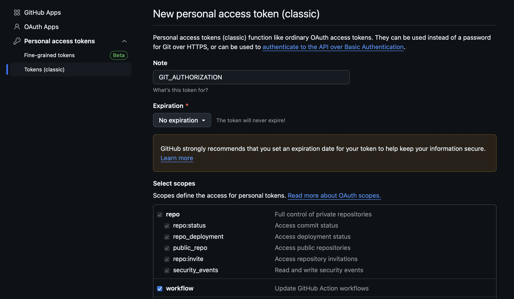
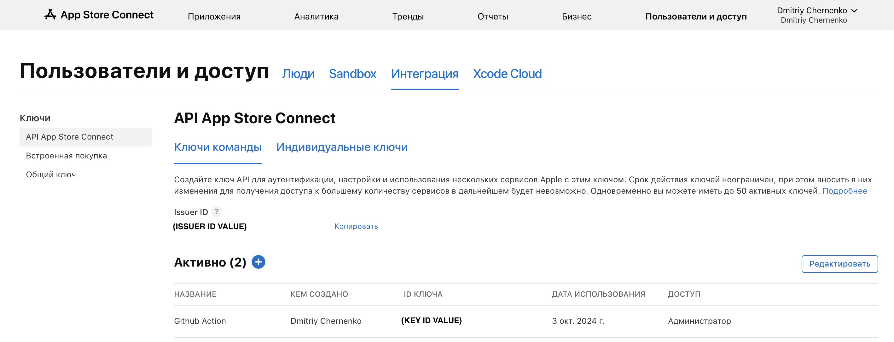
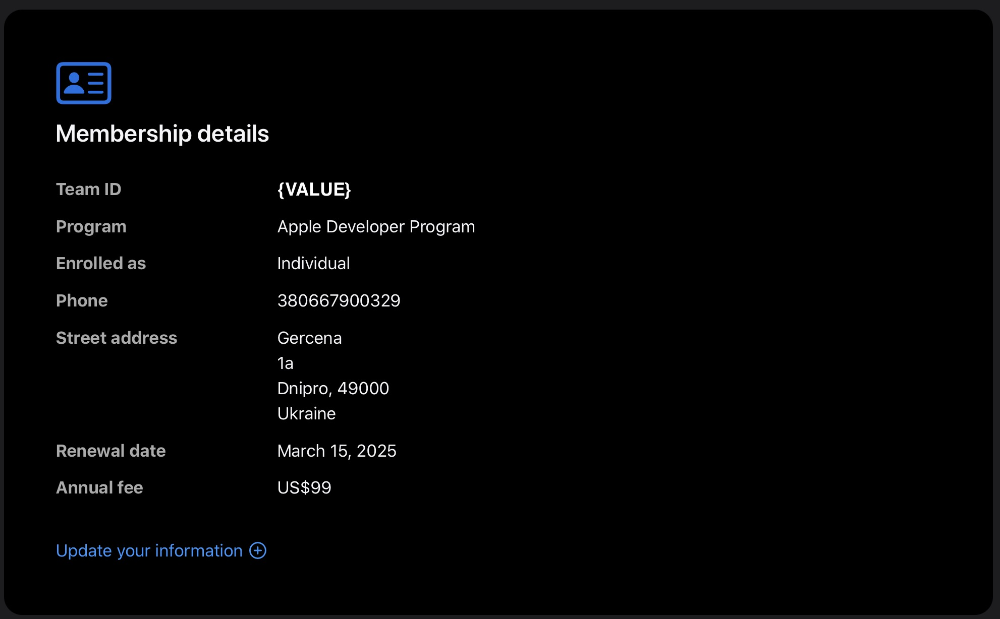
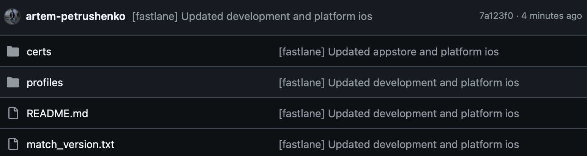
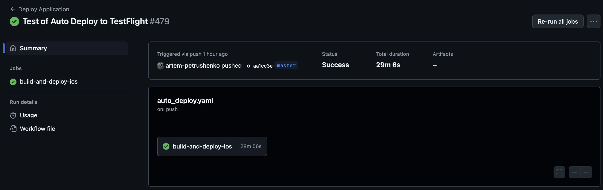
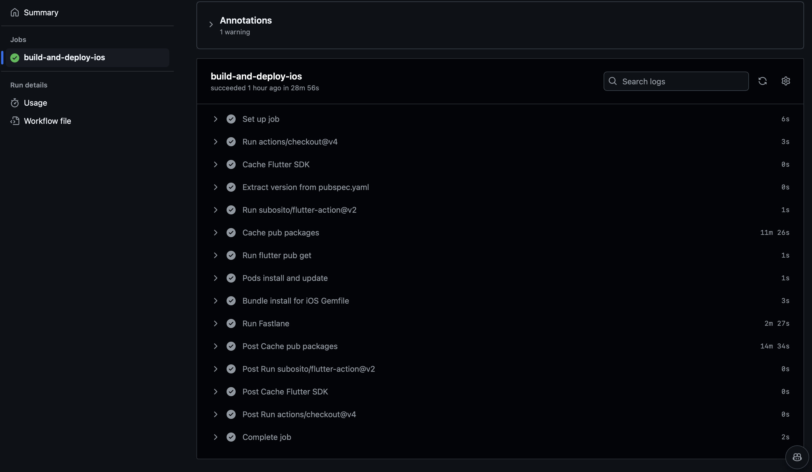

# Автоматическая выгрузка на TestFlight с помощью GitHub Actions

## Конечная цель руководства

Научиться настраивать автоматическую выгрузку приложения **iOS** в **TestFlight** с помощью **GitHub Actions** и
**Fastlane** на собственном удаленном устройстве под управлением **macOS**.

### Условия успешного выполнения руководства

- Аккаунт на который будет происходить выгрузка приложения должен быть
  участником [Apple Developer Program](https://developer.apple.com/programs/).
- Наличие созданного приложения в [App Store Connect](https://appstoreconnect.apple.com/).
- Свое устройство под управлением **macOS**, которое будет выполнять задачу **Runner-а** для сборки и выгрузки
  приложения.

> Указанные выше пункты не будет рассмотрены в данном руководстве, так как они выходят за его рамки. Мы по умолчанию
> подразумеваем, что они уже выполнены.

## Ключи и методы их получения

Наши ключи будут храниться в безопасном месте, чтобы не попасть в руки злоумышленникам. Для этого мы будем использовать
**GitHub Secrets**. Для того чтобы перейти в раздел **Secrets** перейдите в ваш репозиторий на **GitHub** и выберите
вкладку **Settings**. Далее в левой колонке **Secrets** выберете **Secrets and variables** и нажмите на **Actions**.
Теперь вы можете добавить свои ключи нажав на кнопку **New repository secret**.

Для выполнения задачи нам понадобится следующее ключи и идентификаторы:

- GIT_AUTHORIZATION - <YOUR_GITHUB_USERNAME>:<YOUR_PERSONAL_ACCESS_TOKEN>
- APPLE_KEY_ID — App Store Connect API Key ID
- APPLE_ISSUER_ID — App Store Connect Issuer ID
- APPLE_KEY_CONTENT — App Store Connect API Key ID значение, которое храниться в файле .p8
- APP_STORE_CONNECT_TEAM_ID - Team ID вашего аккаунта в App Store Connect
- TEMP_KEYCHAIN_USER & TEMP_KEYCHAIN_PASSWORD - имя и пароль временного хранилища
- MATCH_PASSWORD - пароль для сертификатов

### Git Authorization

Для того, чтобы создать ключ **GIT_AUTHORIZATION** перейдите в настройки профиля на котором будут храниться сертификаты
на **GitHub** и в левой навигационной панели ищем **Developer settings**. Далее переходим в раздел **Personal access
tokens** и нажимаем на
кнопку **Generate new token**. В поле **Note** введите название вашего токена, например **GIT_AUTHORIZATION**.
Далее в разделе **Select scopes** выберите **repo** и **workflow**. Нажмите на кнопку **Generate token**.

Скопируйте ваш токен. Теперь перейдите в настройки вашего репозитория на **GitHub** и в разделе **Secrets** создайте
новый секрет с именем **GIT_AUTHORIZATION** и вставьте в него ваш токен и ник аккаунта по принципу
**<YOUR_GITHUB_USERNAME>:<YOUR_PERSONAL_ACCESS_TOKEN>**.

### Apple Issuer ID, Apple Key ID, Apple Key Content

Чтобы получить **Apple Issuer ID**, **Apple Key ID**, и **Apple Key Content**, перейдите
в [Users and Access](https://appstoreconnect.apple.com/access/integrations/api). Там переходим в раздел **Интеграции**.
В левой колонке выбираем **API App Store Connect** и выбираем раздел **Ключи команды**. Нажимаем на **+** и даем
добавляем
описание, чтобы не забыть назначение ключа а так же, кто сможет с ним работать, в нашем случае через какой аккаунт
будет производиться сборка.

**Внимание!** После создания ключ будет доступен до момента обновления страницы.

- **Apple Issuer ID** - этот значение расположено над списком ключей.
- **Apple Key ID** - это значение расположено в списке ключей и соотвествует скачанном ключу по принципу Auth_{Apple Key
  ID}.p8. Можно закодировать в base64, но в скрипте нужно уточнить это.
- **Apple Key Content** - это значение расположено в скаченном ключе.
  

### Developer Portal Team ID

Для получения **Developer Portal Team ID** перейдите в [Apple Developer](https://developer.apple.com/account). Далее
спуститься ниже до раздела **Membership Details**. В этом разделе будет указано **Team ID**.


## Keychain

Для того чтобы импортировать сертификаты и ключи в **macOS** нам потребуется временное хранилище. Для этого мы будем его
создавать и удалять после выполнения задачи. Для создания временного хранилища нам необходимо создать ключ и пароль.
Эти ключи и пароли мы будем хранить в **GitHub Secrets**.
Ключи будут иметь названия **TEMP_KEYCHAIN_USER** и **TEMP_KEYCHAIN_PASSWORD** для имени и пароля соответственно.

## Настройка Fastlane

Для начала установим **Fastlane** на наше устройство. Для этого выполним команду:

- Перехожу в папку ios

```bash
cd ios
```

- Устанавливаю fastlane

```bash
fastlane init
```

- Далее у нас появляется выбор, что мы хотим настроить. Выбираем **Automate beta distribution to TestFlight**

```bash
What would you like to use fastlane for?
1. 📸  Automate screenshots
2. 👩‍✈️  Automate beta distribution to TestFlight
3. 🚀  Automate App Store distribution
4. 🛠  Manual setup - manually setup your project to automate your tasks
```

- Далее нам предложат ввести **Apple ID** и **App Identifier**. Вводим их и нажимаем **Enter**

```bash
Please enter your Apple ID developer credentials
Apple ID Username:
<YOUR_APPLE_ID_USERNAME>
```

В папке **ios** появится папка **fastlane** с файлом **Fastfile** и **Appfile**. В **Fastfile** мы будем описывать наши
шаги для автоматической выгрузки на **TestFlight**. В **Appfile** мы будем хранить информацию о нашем приложении. Так же
в корне проекта создается файл **Gemfile**. В нем указаны все зависимости для **Fastlane**.

```ruby
source "https://rubygems.org"

gem "xcode-install"

gem "cocoapods"

gem "fastlane"

plugpath = File.join(File.dirname(__FILE__), 'fastlane', 'Pluginfile')
eval_gemfile(plugpath) if File.exist?(plugpath)
```

- Так же, для работы скрипта нам необходимо создать частный репозиторий сертификатов, к которому мы будем обращаться
  через **GIT_AUTHORIZATION**. Назовем его **fastlane**. Копируем ссылку на репозиторий, так как она нам понадобится в
  скрипте.

> Рекомендация: создать приватный репозиторий, так как в нем будут храниться ваши сертификаты и ключи. Так же,
> рекомендуется поставить ветку по умолчанию **master**, так как сертификаты будут храниться в ветке **master**.

Далее запускаем команду:

```bash
fastlane match init
```

- Далее появится выбор, где мы предпочтем хранить сертификаты. Наш выбор - **git**.

```bash
fastlane match supports multiple storage modes, please select the one you want to use:
1. git
2. google_cloud
3. s3
4. gitlab_secure_files
```

- И тут нам понадобиться ссылка на приватный репозиторий сертификатов.

```bash
Please create a new, private git repository to store the certificates and profiles there
URL of the Git Repo: 
<URL_TO_YOUR_PRIVATE_REPOSITORY>
```

После этих действий в папке **fastlane** появится файл **Matchfile**. В нем мы будем хранить информацию о нашем
репозитории сертификатов.

```ruby
git_url("https://github.com/<YOUR_USERNAME>/fastlane/")

storage_mode("git")

type("appstore") # По умолчанию используется development
```

- Следующее действие - генерация сертификатов и ввод ваших учетных данных при запросе с помощью **Fastlane Match**. От
  вас потребуется ввести пароль для сертификатов. Его необходимо сохранить в **GitHub Secrets** под названием
  **MATCH_PASSWORD**, так как он понадобиться в скрипте.

```bash
fastlane match development
```

- Так же мы генерируем сертификаты распространения для **App Store**.

```bash
fastlane match appstore
```

Если все прошло успешно, вы увидите что-то вроде этого:

```bash
All required keys, certificates and provisioning profiles are installed 🙌
```

- После выполнения всех шагов, у вас должны появиться сертификаты и ключи в вашем репозитории.



## Структура скрипта для Fastlane

Файл Fastlane со скриптом состоит из следующих частей:

- Платформа с которой мы будем работать

```ruby
default_platform(:ios)
```

- Получение ключей из хранилища **GitHub Secrets**

```ruby
DEVELOPER_PORTAL_TEAM_ID = ENV["DEVELOPER_PORTAL_TEAM_ID"]
GIT_AUTHORIZATION = ENV["GIT_AUTHORIZATION"]
TEMP_KEYCHAIN_USER = ENV["TEMP_KEYCHAIN_USER"]
TEMP_KEYCHAIN_PASSWORD = ENV["TEMP_KEYCHAIN_PASSWORD"]
APPLE_KEY_ID = ENV["APPLE_KEY_ID"]
APPLE_ISSUER_ID = ENV["APPLE_ISSUER_ID"]
APPLE_KEY_CONTENT = ENV["APPLE_KEY_CONTENT"]
MATCH_PASSWORD = ENV["MATCH_PASSWORD"]
```

- Методы для создания временного хранилища и его удаления. Необходимо, поскольку мы импортируем сертификаты, нам
  требуется создать хранилище для их хранения.

```ruby
def delete_temp_keychain(name)
  delete_keychain(
    name: name
  ) if File.exist? File.expand_path("~/Library/Keychains/#{name}-db")
end

def create_temp_keychain(name, password)
  create_keychain(
    name: name,
    password: password,
    unlock: false,
    timeout: 0
  )
end

def ensure_temp_keychain(name, password)
  delete_temp_keychain(name)
  create_temp_keychain(name, password)
end
```

- Метод для выгрузки на **TestFlight**. В этом методе мы будем использовать ключи, которые мы получили ранее.

```ruby
platform :ios do
  lane :upload_to_store do
    keychain_name = TEMP_KEYCHAIN_USER
    keychain_password = TEMP_KEYCHAIN_PASSWORD
    ensure_temp_keychain(keychain_name, keychain_password)
```

- Метод для создания **API Key** для **App Store Connect**. В этом методе мы будем использовать ключи, которые мы
  получили ранее. Для получения ключа используется метод **app_store_connect_api_key**. В этом методе мы указываем
  следующие параметры:
    - **key_id** - **Apple Key ID**
    - **issuer_id** - **Apple Issuer ID**
    - **key_content** - **Apple Key Content**
    - **duration** - время жизни ключа
    - **in_house** - является ли ключ для **App Store** или **Enterprise**
    - **is_key_content_base64** - если **key_content** закодирован в **base64**, по умолчанию **false**

```ruby
    api_key = app_store_connect_api_key(
      key_id: APPLE_KEY_ID,
      issuer_id: APPLE_ISSUER_ID,
      key_content: APPLE_KEY_CONTENT,
      duration: 1200,
      in_house: false,
      is_key_content_base64: true // если ключ закодирован в base64, по умолчанию false
    )
```

- Установка **Pods** игнорируя **cache**. Это необходимо, чтобы установить **Pods** с нуля.

```ruby
    cocoapods(clean_install: true)
```

- Метод для подписания кода. Состоит из следующих параметров:
    - type - определение типа профиля
    - git_basic_authorization - авторизация для **Git** для дальнейшего получения сертификатов и подписей из репозитория
    - readonly - только для чтения
    - keychain_name - имя временного хранилища
    - keychain_password - пароль временного хранилища
    - api_key - ключ для **App Store Connect**

```ruby
    match(
      type: 'appstore',
      git_basic_authorization: Base64.strict_encode64(GIT_AUTHORIZATION),
      readonly: false,
      keychain_name: keychain_name,
      keychain_password: keychain_password,
      api_key: api_key
    )
```

- Очистка **Flutter** и установка **pub** пакетов

```ruby
    sh("flutter clean")
    sh("flutter pub get")
```

- Собирает проект и упаковывает его в **.ipa** файл. В этом методе мы указываем следующие параметры:
    - **export_method** - метод экспорта, в нашем случае **app-store**
    - **export_options** - опции экспорта, в нашем случае **teamID** - **DEVELOPER_PORTAL_TEAM_ID**

```ruby
    gym(
      export_method: "app-store",
      export_options: {
        teamID: DEVELOPER_PORTAL_TEAM_ID,
      }
    )
```

- Последний метод - выгрузка на **TestFlight**. В этом методе мы указываем следующие параметры:
    - **api_key** - ключ для **App Store Connect**
    - **ipa** - путь к **.ipa** файлу
    - **skip_submission** - пропустить отправку на **App Store Connect**
    - **skip_waiting_for_build_processing** - пропустить ожидание обработки сборки

```ruby
    pilot(
      api_key: api_key,
      ipa: "./Runner.ipa",
      skip_submission: true,
      skip_waiting_for_build_processing: true
    )
  end
end
```

## Настройка GitHub Actions

Для начала создадим файл **.github/workflows/auto_deploy.yaml** в корне нашего проекта. В этом файле мы будем описывать
наши шаги для автоматической выгрузки на **TestFlight**. Код файла будет состоять из следующих частей:

- **name** - название нашего действия

```yaml
name: Deploy Application
```

- **on** - событие, при котором будет запускаться наше действие

```yaml
on:
  push:
    branches:
      - master
```

- **jobs** - описание наших задач с указанием на **self-hosted** для запуска нашего действия на нашем удаленном
  устройстве под управлением **macOS**. Наша задача будет состоять из следующих шагов:
    - **checkout** - клонирование нашего репозитория
    - **cache** - кеширование **Flutter SDK**
    - **flutter-action** - установка **Flutter SDK**
    - **cache** - кеширование **pub packages**
    - **run** - установка пакетов **pub**
    - **run** - установка **Pods**
    - **run** - установка **bundle**
    - **run** - запуск **Fastlane** c указанием переменных окружения полученных из **GitHub Secrets**

```yaml
jobs:
  build-and-deploy-ios:
    runs-on: self-hosted

    steps:
      - uses: actions/checkout@v4
      - name: Cache Flutter SDK
        uses: actions/cache@v4
        with:
          path: /opt/flutter
          key: flutter-sdk-${{ runner.os }}-${{ hashFiles('pubspec.yaml') }}
          restore-keys: |
            flutter-sdk-${{ runner.os }}-

      - uses: subosito/flutter-action@v2
        with:
          flutter-version: '3.24.0'
          channel: 'stable'

      - name: Cache pub packages
        uses: actions/cache@v4
        with:
          path: |
            ~/.pub-cache
          key: pub-cache-${{ runner.os }}-${{ hashFiles('pubspec.yaml') }}
          restore-keys: |
            pub-cache-${{ runner.os }}-

      - run: flutter pub get

      - name: Pods install and update
        run: |
          cd ./ios 
          pod install
          pod update

      - name: Bundle install for iOS Gemfile
        run: |
          cd ./ios
          bundle install

      - name: Run Fastlane
        run: |
          cd ./ios  
          bundle exec fastlane upload_to_store
        env:
          DEVELOPER_PORTAL_TEAM_ID: '${{ secrets.DEVELOPER_PORTAL_TEAM_ID }}'
          GIT_AUTHORIZATION: '${{ secrets.GIT_AUTHORIZATION }}'
          TEMP_KEYCHAIN_USER: '${{ secrets.TEMP_KEYCHAIN_USER }}'
          TEMP_KEYCHAIN_PASSWORD: '${{ secrets.TEMP_KEYCHAIN_PASSWORD }}'
          APPLE_KEY_ID: '${{ secrets.APPLE_KEY_ID }}'
          APPLE_ISSUER_ID: '${{ secrets.APPLE_ISSUER_ID }}'
          APPLE_KEY_CONTENT: '${{ secrets.APPLE_KEY_CONTENT }}'
          MATCH_PASSWORD: '${{ secrets.MATCH_PASSWORD }}'
```

## Результат

После выполнения всех шагов, вы сможете автоматически выгружать ваше приложение на **TestFlight** с помощью **GitHub
Actions** и **Fastlane**. Теперь вам не нужно тратить время на ручное создание **build**-ов и выгрузку их на
**TestFlight**. Все это можно сделать автоматически.





## Возможные проблемы

Когда вы запускаете скрипт **Fastlane**, у вас может возникнуть ошибка, во время выполнения команды

```bash
Invalid password passed via 'MATCH_PASSWORD'
```

Если Вы уверены, что пароль введен верно - попробуйте удалить сертификаты и пересоздать их с новым паролем.

```bash
fastlane match nuke distribution
fastlane match nuke development
fastlane match development
fastlane match appstore
```

