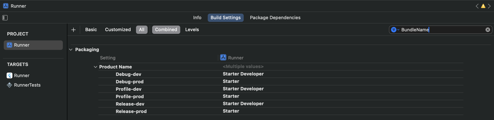

# Использование Flavor во Flutter приложениях

## Что такое Flavor?

В процессе разработки в определенный момент Вы сталкиваетесь с проблемой создания различных версий одного и того же
приложения. Например, Вам нужно создать версию приложения для разработки, тестирования и конечного пользователя.
Каждая из этих версий может отличаться друг от друга по функционалу, внешнему виду и другими параметрами. Для решения
этой проблемы во Flutter используется механизм Flavor.

[Flavor](https://docs.flutter.dev/deployment/flavors) - это способ создания различных версий одного и того же
приложения, которые могут отличаться друг от друга по функционалу, внешнему виду и другим параметрам. Во Flutter это
достигается с помощью использования различных конфигурационных файлов и сборок.

## Основные отличия между версиями приложения

### Flavor среды (Flavor Environment)

Окружение для сборки приложения. В нашем случае мы выделили два варианта:

- **Development** - сборка для разработки, которая будет ссылаться на домены разработчиков и иметь соответствующие
  настройки.


- **Production** - сборка для конечного пользователя, которая будет ссылаться на домены конечного пользователя и иметь
  соответствующие настройки.

Среди отличий мы выделим следующие:

| Зависимость | Development                     | Production                  |
|-------------|---------------------------------|-----------------------------|
| hostURL     | https://flutter-starter-dev.com | https://flutter-starter.com |
| appName     | Starter Developer               | Starter                     |
| bundleId    | com.starter.dev                 | com.starter                 |

### Режимы сборки приложения (Build Mode)

Во Flutter присутствуют _три типа сборок_ приложения:

- **Debug** - сборка для разработки, в которой включены все отладочные функции и отключены оптимизации;


- **Profile** - сборка для профилирования, в которой включены оптимизации, но отключены отладочные функции;


- **Release** - сборка для конечного пользователя, в которой включены все оптимизации и отключены отладочные функции.

### Варианты сборок приложения

Варианты сборок - это комбинация режима сборки и вариантов Flavor. В нашем случаем мы рассмотрим три варианта сборок и
две

версии Flavor. Методом не сложных вычислений мы **получаем 6 вариантов сборок**, которые представлены ниже:

| Flavor Dependencies | Build Mode | Build Variants |
|---------------------|------------|----------------|
| Developer           | Debug      | debug-dev      |
|                     | Profile    | profile-dev    |
|                     | Release    | release-dev    |
| Production          | Debug      | debug-prod     |
|                     | Profile    | profile-prod   |
|                     | Release    | release-prod   |

## Создание Flavor во Flutter

### Создание класса для хранения настроек

Для работы с настройками Flavor во Flutter, создадим класс `environment.dart`, который состоит из следующих
составляющих:

- **Flavor** - перечисление, которое содержит варианты Flavor. В нашем случае это `dev` и `prod`. Каждый вариант
  содержит свой `value`. Также в классе есть метод `from()`, который принимает значение `value` и возвращает
  соответствующий вариант `Flavor`.

```
enum Flavor {
  dev('DEV'),
  prod('PROD');

  final String value;

  const Flavor(this.value);

  static Flavor from(String? value) {
    switch (value) {
      case 'DEV':
        return Flavor.dev;
      case 'PROD':
        return Flavor.prod;
      default:
        return kReleaseMode ? Flavor.prod : Flavor.dev;
    }
  }
}
```

- **AppConfig** - класс, который содержит настройки для каждого варианта Flavor. В нашем случае это `hostUrl`
  и `jsonFile`. Также в классе есть метод `_initialize()`, который принимает вариант `Flavor` и возвращает
  соответствующий объект `AppConfig`.

```
class AppConfig {
  static AppConfig? _instance;

  static AppConfig get config {
    if (_instance == null) {
      throw StateError('AppConfig has not been initialized.');
    }
    return _instance!;
  }

  final Flavor environment;
  final String hostUrl;

  AppConfig._internal({
    required this.environment,
    required this.hostUrl,
  });

  factory AppConfig(String packageName) {
    final environment = const EnvironmentConfig().getEnvironment(packageName);
    _instance = AppConfig._initialize(environment);
    return _instance!;
  }

  static AppConfig _initialize(Flavor environment) {
    switch (environment) {
      case Flavor.prod:
        return AppConfig._internal(
          environment: Flavor.prod,
          hostUrl: 'https://flutter-starter.com',
        );
      case Flavor.dev:
      default:
        return AppConfig._internal(
          environment: Flavor.dev,
          hostUrl: 'https://flutter-starter-dev.com',
        );
    }
  }
}
```

- **EnvironmentConfig** - класс, который содержит метод `getEnvironment()`, который принимает `packageName` и возвращает
  соответствующий вариант `Flavor`.

```
class EnvironmentConfig {
  const EnvironmentConfig();

  Flavor getEnvironment(String? packageName) {
    if ((Platform.isAndroid && packageName == 'com.starter') || (Platform.isIOS && packageName == 'com.starter')) {
      return Flavor.prod;
    }
    return Flavor.dev;
  }
}
```

### Запуск приложения с выбранным набором зависимостей

Для запуска приложения есть несколько вариантов:

- **Запуск через терминал**:

```
flutter run --flavor dev
```

Или же через визуальную команду:

- Запуск через Android Studio:
- Откройте файл `main.dart`;
- Нажмите на кнопку `Edit Configurations`;
- Во вкладке `Build Flavor` добавляем значение `dev`;
- Нажмите на кнопку `Apply` и `OK`;
- Запустите приложение.

Во втором случае, мы также имеем возможность создать несколько конфигураций для разных сред. Например, для среды
разработки и для среды продакшена. Ниже приведены настройки для создания конфигурации для среды разработки:

- **DEV**:
- Имя: `dev`
- Build Flavor: `dev`

- 

- **PROD**:
- Имя: `prod`
- Build Flavor: `prod`


## Настройка Android проекта

- Для создания Flavor в Android проекте, необходимо перейти в `android/app/build.gradle` и добавить следующий код.

В `defaultConfig` добавляем `applicationId` и ставим ему значение `com.starter`.

Затем добавляем `flavorDimernsions` и для него свои Flavor. В данном случае мы создаем два варианта Flavor: `dev`
и `prod`. Для варианта `dev` мы указываем `applicationIdSuffix` и `vesionNameSuffix`, а для каждого варианта
указываем `resValue` для `app_name`.

```
    defaultConfig {
        applicationId = "com.starter"
        minSdk = flutter.minSdkVersion
        targetSdk = flutter.targetSdkVersion
        versionCode = flutter.versionCode
        versionName = flutter.versionName
    }
    
    flavorDimensions "default"
    productFlavors {
        prod {
            dimension "default"
            resValue "string", "app_name", "Starter"
        }
        dev {
            dimension "default"
            applicationIdSuffix ".dev"
            resValue "string", "app_name", "Started Developer"
            versionNameSuffix ".dev"
        }
    }
```

- Чтобы название отображалось в настройках приложения, необходимо перейти в AndroidManifest.xml и добавить следующий код
  в application:

```
android:label="@string/app_name"
```

## Настройка iOS проекта

### Создание Flavor в iOS проекте

- Первое, что нам необходимо - открыть для удобства проект в Xcode.


- Далее выбираем `Runner`, затем `Scheme`, после чего `New Scheme...`. Вводим название схемы, например `dev`.


- После проделанных действий переходим в `Runner`, `Runner`(Project) и дублируем конфигурации. Для этого нажимаем на `+`
  и выбираем `Duplicate "Debug" Configuration`. Повторяем для всех конфигураций. После чего переименовываем, добавляя
  суффикс `-dev` и `-prod` соответственно.


- Далее переходим в `Manage Schemes...` и выбираем `dev`. В открывшемся окне меняем конфигурацию на `dev`.

Аналогично для `prod`, только меняем конфигурацию на `prod`.


- Чтобы поменять bundleID для каждого варианта Flavor, переходим в `Runner`, `Runner`(Target) и
  меняем `Bundle Identifier`.


- Для того чтобы поменять название приложения для каждого варианта Flavor, переходим в `Runner`(
  Project), `Build Settings` и меняем `Product Name`.



- Чтобы название отображалось в настройках приложения, необходимо добавить `Info.plist` в `Runner` и
  добавить `Bundle display name` с соответствующим значением.


- Последний шаг - настройка Podfile для каждого варианта Flavor. Для этого необходимо добавить следующий код
  в `Podfile`:

```
project 'Runner', {
  'Debug-prod' => :debug,
  'Profile-prod' => :release,
  'Release-prod' => :release,
  'Debug-dev' => :debug,
  'Profile-dev' => :release,
  'Release-dev' => :release,
}
```

## Заключение

В данной статье мы рассмотрели, что такое Flavor и как его использовать в Flutter приложениях. Мы создали два варианта
Flavor: `dev` и `prod`, а также рассмотрели как настроить Android и iOS проекты для работы с Flavor.


| Prod                             | Dev                             |
|----------------------------------|---------------------------------|
|  |  |


