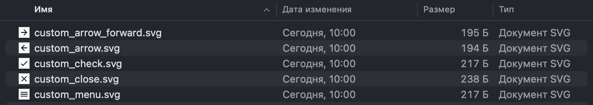
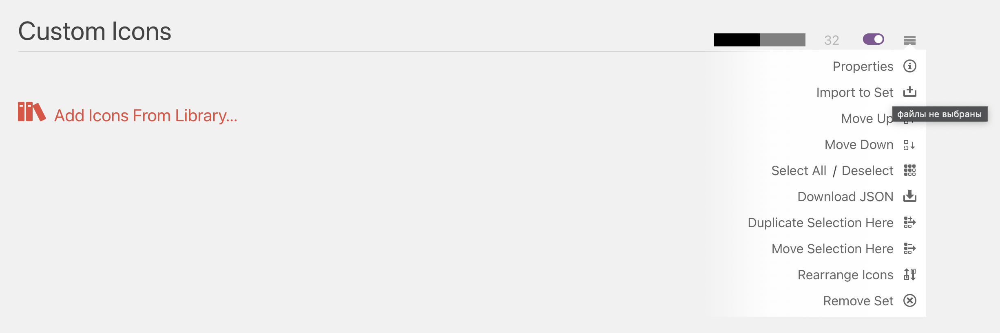
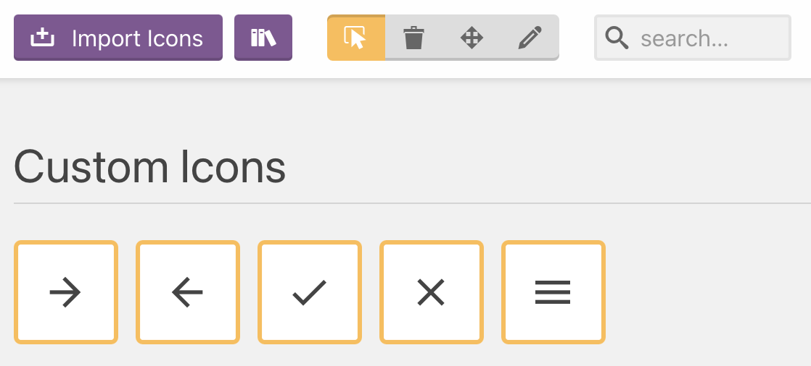
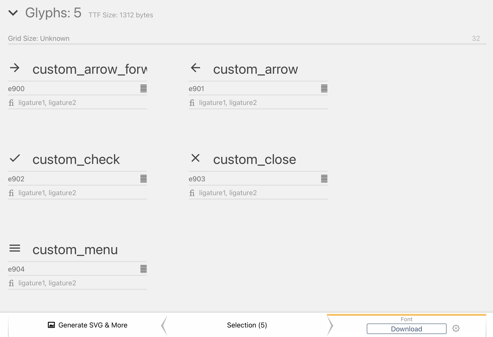
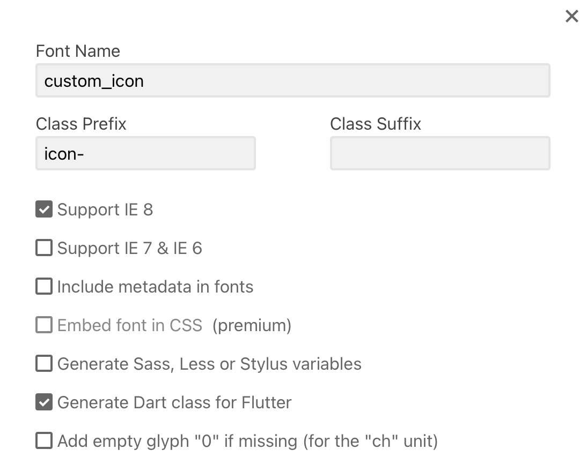
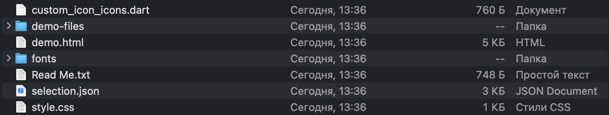
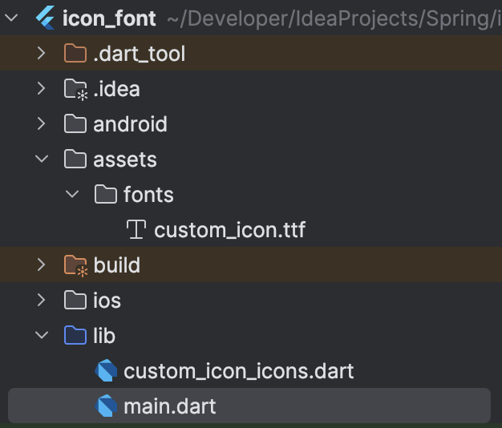
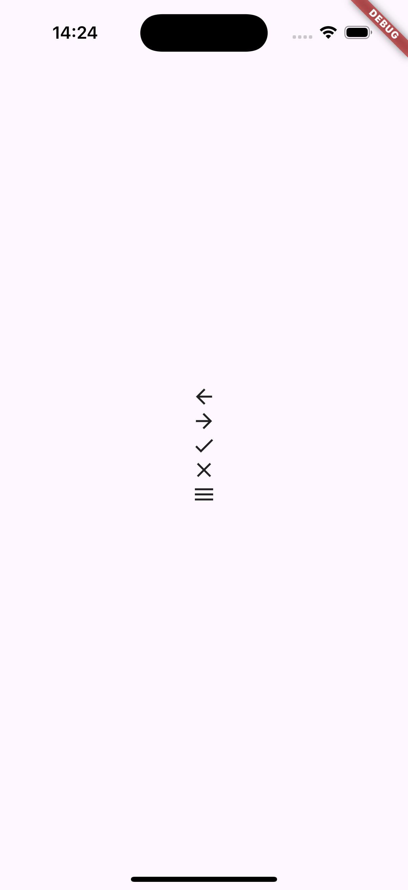

# Собственные иконки с использованием IconData во Flutter

## Введение

Причиной для написания данной инструкции послужили проблемы, при работе с векторной графикой во Flutter. В фреймворке
есть следующие способы работы с иконками:

- Дефолтные иконки из `MaterialIcons` и `CupertinoIcons`, которые дают возможность взаимодействия с векторными иконками
  из Material Design и iOS при помощи `IconData`, но не позволяют использовать собственные иконки.
- Использование иконок из пакетов `flutter_svg`, дающих возможность использовать SVG-иконки. Но в этом случае у нас есть
  определенные проблемы:
    - С иконками в формате SVG можно взаимодействовать только через виджет `SvgPicture`, что не всегда удобно.
    - Возникают артефакты при запуске на движке `Impeller`, что создает дополнительные побочные баги и решается
      переходом на устаревший движок `Skia`.

Для решения этой проблемы можно использовать следующий подход:

Создать собственный класс, который будет содержать в себе `IconData` для каждой иконки. Таким образом, мы сможем
использовать собственные иконки во Flutter, а также взаимодействовать с ними при помощи `IconData`. Так же, нам не
потребуется использовать дополнительные виджеты и пакеты для отображения иконок. И как следствие отказываться от
движка `Impeller`.

Но для того, чтобы использовать собственные иконки, нам необходимо создать их.

## Создание иконок

1. Первая задача это скачать необходимые изображения в формате SVG.
   
2. Далее, мы воспользуемся сервисом [Icomoon](https://icomoon.io/app/), который позволяет конвертировать SVG-иконки
   в `IconData`. Для того чтобы загрузить иконки, открываем меню в правом верхнем углу необходимого нам сета и выбираем
   пункт `Import to Set` и выбираем наши иконки в формате `.svg`.
   
3. Загруженные иконки нам необходимо выделить и перейти на экран `Generate Font`.
   
4. На экране `Generate Font` мы можем увидеть миниатюры иконок, их название и код. Их название и код мы можем
   отредактировать.
   
5. Далее, перед скачиванием нам необходимо перейти в настройки и включить генерацию файла `.dart` через пункт
   `Generate Dart class for Flutter`.
   
6. Далее, нам необходимо скачать наш сет иконок. Содержимое архива мы можем увидеть на скриншоте ниже.
   
7. Далее, нам необходимо шрифт и файл `.dart` скопировать в проект. Шрифт мы можем найти в папке `assets/fonts`, а файл
   `.dart` в папке `src`.
   
8. Далее, нам необходимо подключить шрифт в `pubspec.yaml` в проект.
   ```yaml
   flutter:
     fonts:
       - family: CustomIcons
         fonts:
           - asset: assets/fonts/custom_icons.ttf
   ```
9. Далее, нам необходимо подправить `.dart` файл, в котором содержаться шрифты.
   До редактирования:

```dart
import 'package:flutter/widgets.dart';

class Custom_icon {
    Custom_icon._();
    
    static const String _fontFamily = 'custom_icon';
    
    static const IconData custom_arrow_forward = IconData(0xe900, fontFamily: _fontFamily);
    static const IconData custom_arrow = IconData(0xe901, fontFamily: _fontFamily);
    static const IconData custom_check = IconData(0xe902, fontFamily: _fontFamily);
    static const IconData custom_close = IconData(0xe903, fontFamily: _fontFamily);
    static const IconData custom_menu = IconData(0xe904, fontFamily: _fontFamily);
}
```

Исправляем на правильный, с учетом правил языка Dart:

```dart
import 'package:flutter/widgets.dart';

class CustomIcon {
  CustomIcon._();

  static const String _fontFamily = 'CustomIcon';

  static const IconData customArrowForward = IconData(0xe900, fontFamily: _fontFamily);
  static const IconData customArrow = IconData(0xe901, fontFamily: _fontFamily);
  static const IconData customCheck = IconData(0xe902, fontFamily: _fontFamily);
  static const IconData customClose = IconData(0xe903, fontFamily: _fontFamily);
  static const IconData customMenu = IconData(0xe904, fontFamily: _fontFamily);
}
```

10. Последнее, что нам необходимо - это вызвать иконку в виджете. Для этого нам необходимо использовать виджет `Icon`
    и передать в него нашу иконку.

```dart
Column(
  mainAxisSize: MainAxisSize.min,
  children: [
    Icon(CustomIcon.customArrow),
    Icon(CustomIcon.customArrowForward),
    Icon(CustomIcon.customCheck),
    Icon(CustomIcon.customClose),
    Icon(CustomIcon.customMenu),
  ],
),
```

В итоге мы получили доступ к векторным изображениям, которые можно использовать в проекте и без необходимости
использовать сторонние решения. Все иконки будут отображаться корректно и без артефактов. Пример иконок можно увидеть на
скриншоте ниже.



## Проблемы, которые могут возникнуть в процессе создания иконок
