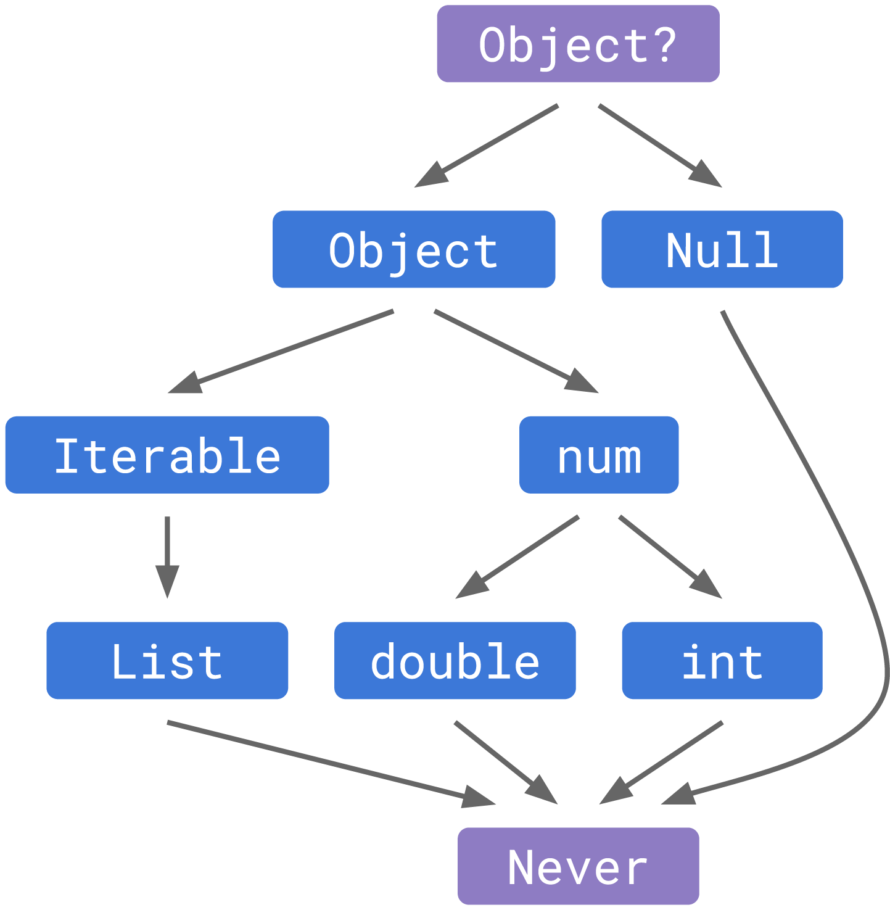
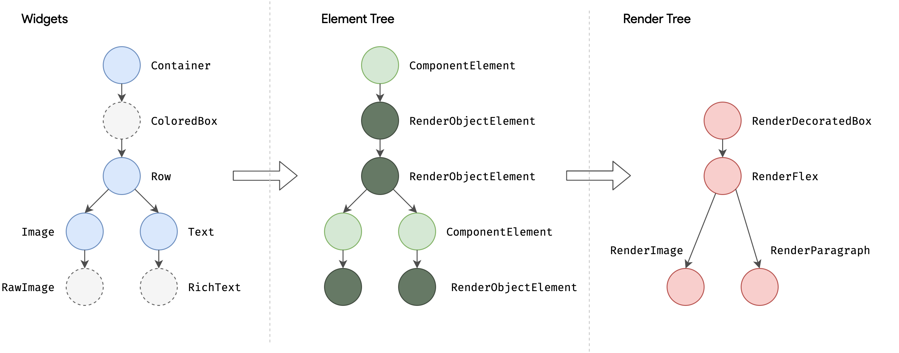
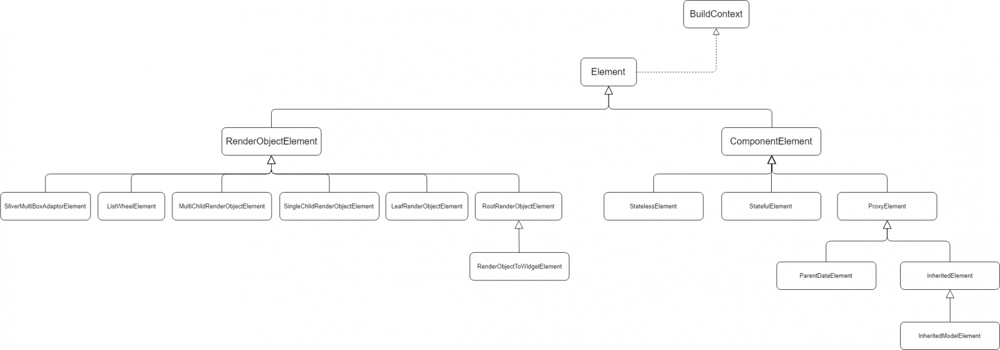
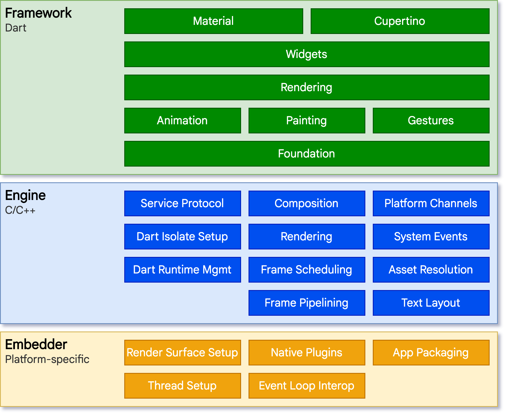
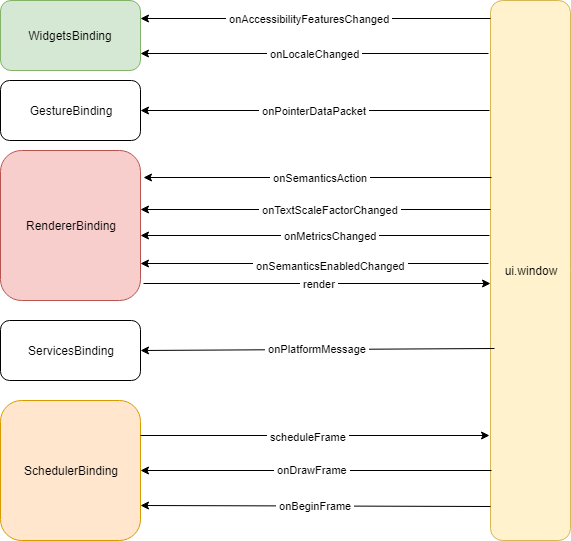
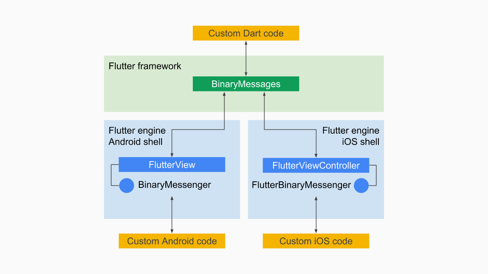
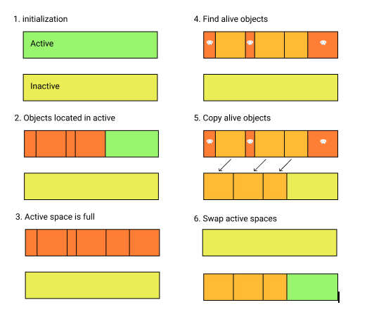
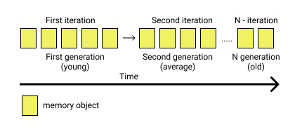

# Flutter Developer Interview Questions

## Базовые вопросы по Flutter

1. В чем отличие package и plugin в Flutter?

   A package is a set of classes, interfaces, and sub-packages that allow users to create modular code that can be
   shared easily. Instead of starting from scratch, using packages can help construct applications fast. In Flutter, you
   may use a package to add new widgets or functionality to an app.

   On the other hand, a plugin is a piece of software that enhances your app's functionality. Plugins play a crucial
   role in the Flutter ecosystem.

2. Что такое ключи и как их использовать?
   A set of IDs for Widgets, Elements and SemanticsNodes make up the key class. Keys are responsible for preserving the
   state of widgets when they are updated inside the widget tree. Keys may also be used to modify and rearrange
   collections of widgets of the same type and defined states.

   Otherwise, keys may be superfluous to the code, even if they aren't harmful in any manner. Keys are useful when you
   need to edit a widget tree with stateful widgets, but not when the tree is entirely made up of stateless widgets.

3. What are the different types of streams in Dart?
   Streams provide an asynchronous sequence of data. Asynchronous programming uses the idea of streams. They refer to a
   program's asynchronous succession of data occurrences. We put a value on one end and a listener on the other, similar
   to a pipe. Several listeners can be combined into a single stream, and when they are placed in the pipeline, they
   will all get the same data. It is possible to utilize the SteamController to establish new streams or manage existing
   ones. There are two types of streams:

   Single Subscription Streams
   These streams convey events in chronological order. They're thought of as individual sequences inside a greater
   totality. When the sequence in which events are received matters, such as when reading a file, these streams are
   employed. Throughout the sequence, there can only be one listener, and the event will not be triggered if there isn't
   one.
   Broadcast Streams
   These broadcasts provide subscribers with information about upcoming events. Subscribers can instantly begin
   listening
   to events after subscribing to them. These are flexible streams that allow several listeners to listen at the same
   time.
   Furthermore, even after canceling a previous membership, one may listen again.

4. What is pubspec.yaml file?

   While creating a Flutter project, a particular type of file is always included at the top of the project. This file
   is known as the pubspec.yaml file, also called ‘pubspec’. This file contains information about a project's
   dependencies, such as packages and their versions, typefaces, and so on. It ensures that the package version is the
   same the next time you create the project. You can also place restrictions on the app. This project's configuration
   file will be used a lot while working with the Flutter project. This specification is written in YAML, a
   human-readable markup language.

5. Can you tell us the four main elements of Flutter?
   The four main elements of Flutter are:
   Flutter engine
   Widgets
   Design-specific widgets
   Foundation Library

6. Can you tell us how many kinds of widgets there are in Flutter?
   There are two main types of widgets in Flutter. These include:

StatelessWidget- It does not have any state information. It is static throughout its lifecycle. Examples are Row, Text,
Column, and Container.

StatefulWidget- It has state information. It contains two classes: the state object and the Widget. It is dynamic
because it can change the inner data during the Widget's lifetime. Examples are Radio, Form, Checkbox, and TextField.

7.

What is the use of the Await function?
The Await function is an asynchronous function. Its job is to wait until it gets the final value. Await is used with
async functions and that run asynchronously, giving users the choice to wait for the asynchronous mode to finish before
continuing.

8. runApp
9.

Explain the term “Tree shaking” in Flutter.
Hide Answer
Tree shaking is a method of removing the unused module in the bundle during the development process. Tree shaking serves
as a sort of optimization technique that optimizes the code by removing the dead code.

While importing or exporting codes, there might be dead codes hanging around. Removing these dead codes reduces the code
size which in turn improves the performance of the application.

10. What's the role of BuildContext in Flutter?
    Hide Answer
    In Flutter, the BuildContext is an object that provides access to the location of a widget in the widget tree
    hierarchy and to various services such as Theme, MediaQuery, and Navigator. The BuildContext is used by widgets to
    access the properties of their parent widget, such as its size, position, and theme. It is also used to navigate
    between screens using the Navigator widget.

11.

What process will you use to reduce widget rebuild?
On rebuilding, the state of the widget changes. This, however, helps the user to see the UI reflect state changes. At
this point recreating sections of the user interface that do not need to be changed is unnecessary.

To avoid the needless rebuilding of the widgets one can divide the widget tree into small individual widgets each having
its own build process. Here const constructor can be used to inform Flutter that the dont need to be rebuilt.

## INTERMEDIATE FLUTTER INTERVIEW QUESTIONS AND ANSWERS

1.

Tell me about Flutter Provider.
Widgets are used to build the provider. Inside the provider, one can use all the objects as if they are a part of it
with the new widget subclasses it creates. Primarily, it works on the concept of PUB-SUB which means one provider with
many subscribers.

2.

Explain Streams in Flutter?
Future and Stream are classes in Dart that define asynchronous programming. It behaves asynchronously as it doesn't
return the next event when requested. Instead, it informs when the next event will be returned when ready.

4.

What do you mean by Container class?
The container class is the convenience widget that enables positioning, sizing, and painting of widgets. A container
class can include multiple widgets and it enables developers to manage those widgets according to their convenience.

5. Can you name some popular database packages in Flutter?
6. Can you tell us some differences between const and final in Flutter?
   The only difference between const and final is that the const variables are evaluated at compile-time and are
   immutable whereas final variables are evaluated at runtime and can only be set once.
7. How would you optimize the performance of a Flutter app?
   Some techniques to optimize the performance of a Flutter app include using the const keyword to make widgets
   immutable, avoiding unnecessary widget rebuilds, using the Provider package for efficient state management, and
   minimizing the number of expensive operations in the build method.
   So, if your app is small, you can pass your data using the constructor of the widget class, but for a larger app,
   this
   is not an easy task. Unknowingly we use inherited widgets in many places while developing the flutter app.Theme.of(
   context), Navigator.of(context), and MediQuery.of(context).
8. Differentiate between setState and Provider?
   The setState() is used for managing the local state. Calling the setState() function notifies the framework about the
   change in the state of the object and that may affect the user interaction in the subtree.

Whereas, provider is a state management technique in Flutter that allows widgets to access data from a central
location (i.e., a "provider"). Providers can be used to manage the application state, such as user authentication or
data fetched from an API.

9.

Can you state some difference between runApp() and main()?
Main(): Main() function starts the program. You cannot write a program in Flutter without using the main() function
whereas runApp() is used to launch the software. RunApp() allows you to return the widgets that are connected to the
screen as the widget tree’s root.

10. What’s the need of mixins?
    Multiple inheritances are not supported in Dart. Hence, you would need mixins to use multiple inheritance in
    Flutter, as
    they allow you to write reusable class code in multiple class hierarchies.

11. What is the difference between hot reload and hot restart?
    Hide Answer
    In Flutter, Hot Reload is the easiest and quickest way to make any changes, create UIs, fix bugs, and add features
    to the app. A Hot Reload performs all these changes rapidly and makes changes in the UI without disturbing the
    entire app.

Here’s how to perform Hot Reload:

Run the Flutter editor using command prompt or editor.
Once the project is created, you can use debug mode and perform hot reload
In windows, use “ctrl+\” to perform hot reload or using the button. For Mac devices, you can use “cmd+s” to perform hot
reload. If you’re using the command prompt enter ‘r’ to run.
A Hot Restart is different from Hot Reload as it demolishes the preserved states of the app and compiles the code from
scratch.
Hot Restart takes more time as compared to Hot Reload but takes less time than restart function.
Here’s how to perform Hot Restart:

Run the editor using command prompt
Make some changes and run the hot restart
To start hot restart use the hot reload button or press ctrl+shift+.

15. What is the difference between push and pushReplacement methods in Flutter?

In Flutter, push and pushReplacement are two methods that are used to navigate between different screens in an app. Both
methods are available on the Navigator class, which manages the navigation stack in a Flutter app.

The push method is used to push a new route onto the navigation stack, which adds a new screen to the app’s UI. This
method does not remove the previous screen from the stack, which means that the user can use the back button or swipe
gesture to navigate back to the previous screen.
The pushReplacement method is similar to the push method, but it replaces the current screen on the navigation stack
with a new screen. This means that the previous screen is removed from the stack and cannot be navigated back to using
the back button or swipe gesture.
So, the main difference between push and pushReplacement methods is that push adds a new screen to the navigation stack
while pushReplacement replaces the current screen with a new screen.

16. Architecture Layer in Flutter

Flutter's architecture is modular and layered. Here's a breakdown:
Embedder: The foundational layer, it provides platform-specific integrations, enabling Flutter to run on diverse
systems.
Engine: Written in C++, this layer manages core tasks like graphics rendering, text layout, and file/network operations.
Framework: Sitting atop the Engine, it offers high-level classes for app development. This includes the Widget layer,
which offers a vast array of visual, structural, platform, and interactive widgets, the Rendering layer that paints the
widget onto the canvas, and several others that provide services and utilities.

17. Difference between AOT and JIT
    JIT (Just-In-Time) and AOT (Ahead-Of-Time) are two compilation approaches in Dart.
    JIT compilation happens at runtime, translating the code into machine language just before it's executed. This
    allows for features like hot-reloading in Flutter, where changes can be injected into a running application.
    AOT, on the other hand, compiles the code into machine language before the app is launched. This results in faster
    startup times and optimized performance, making it the preferred choice for production Flutter apps.

18. Access modifiers in Dart
    Dart offers a set of access modifiers to control the visibility of members: public (default, if no modifier is
    specified), private (indicated by a leading underscore _), and protected (not explicitly available but achieved
    through conventions). Dart's approach to privacy is library-based, meaning that private members are hidden within
    the same library file but can be accessed across classes within that file.

19. Difference between Named Construction and Factory
    In Dart, a named constructor allows a class to define multiple ways to initialize, using different names for
    clarity. It directly creates a new instance of the class. On the other hand, a factory is a special kind of
    constructor that doesn't always return a new instance. Instead, it can return an existing instance, an instance of a
    subtype, or even an instance of a completely different class. While named constructors offer varied initialization
    methods, factories provide greater control over the object creation process.
20. principles of OOP
    The four foundational principles of OOP are Encapsulation, Inheritance, Polymorphism, and Abstraction.
    Encapsulation bundles data and methods operating on that data within a single unit, ensuring data integrity.
    Inheritance allows a class to inherit properties and behaviors from another class.
    Polymorphism permits one interface to be used for a general class of actions.
    Abstraction hides complex implementations and exposes only the necessary functionalities.
21. SOLID
    SOLID is an acronym representing five design principles that ensure software is scalable, maintainable, and
    organized. They are:
    Single Responsibility Principle: A class should have only one reason to change.
    Open/Closed Principle: Software entities should be open for extension but closed for modification.
    Liskov Substitution Principle: Subtypes must be substitutable for their base types.
    Interface Segregation Principle: Clients should not be forced to depend on interfaces they don't use.
    Dependency Inversion Principle: High-level modules should not depend on low-level ones; both should depend on
    abstractions
22. Object, var, dynamic
    Object is the root class for all Dart classes, allowing a variable to hold any type of value but requires explicit
    casting for most operations.
    dynamic is a type that bypasses static type checking, offering flexibility at the cost of forgoing some compile-time
    checks.
    var is a keyword used to declare a variable without specifying its type. Dart determines and fixes the variable's
    type based on its initial value at compile-time.
23. cascade and spread operators
    The cascade operator (..) allows for performing a series of operations on a single object without breaking the
    chain. For instance:
    var obj = Object()..method1()..method2();
    The spread operator (...) is used to insert multiple elements from one collection into another. It's especially
    useful when constructing lists or other collections:
    var list = [1, 2, ...otherList, 3];
24. Null Safety
    Null safety in Dart is a robust feature designed to avoid null reference errors, enhancing the stability of apps.
    The term "sound" in null safety implies that if an expression is determined by the static type system to be
    non-nullable, then, under no circumstances can the expression evaluate to null at runtime. This soundness is
    primarily ensured through static checks, but there can also be runtime checks, which are introduced by choice, to
    validate the non-nullability of an expression.
    To denote a variable as nullable, you append a ?:
    int? nullableVariable;
    Dart provides operators like ?? to assign a default value when a variable is null, and ?. to invoke a method if an
    object is non-null:
    int nonNullable = nullableVariable ?? 0;
    nullableVariable?.method();
    To assert that a nullable variable is non-null, the ! operator is used:
    int nonNullable = nullableVariable!;
    Employing null safety is vital for preventing null reference exceptions, ensuring the reliability and
    maintainability of the code, and allowing developers to identify and rectify potential errors during the development
    phase, contributing to the overall quality of the application.
25. Isolate, Future and Event Loop
    In Dart, an Isolate is akin to a separate execution thread with its own memory, ensuring that Dart remains free of
    shared-state concurrency issues. Each isolate has its own memory heap, ensuring that no isolate's state is
    accessible from any other.
    The Event Loop is a mechanism that handles the execution of events or messages for a particular thread. It
    continually checks if there are tasks to execute and runs them in order.
    Future represents a potential value or an error that will be available at some time in the future. It's a core part
    of Dart's asynchronous programming model, allowing developers to write non-blocking code for operations that might
    take time, like fetching data from a server.
26. setState()
    In Flutter, Stateless widgets are static and don't change, ideal for elements like icons or labels that remain
    constant. They are less resource-intensive and efficient for static content. On the other hand, Stateful widgets can
    maintain state, allowing for dynamic and interactive UIs, essential for areas of the UI that user can interact with
    or that can change due to real-time data updates.
    The setState() function is crucial in Stateful widgets; it signals the framework that the state of a widget has
    changed, prompting a UI rebuild. For instance, it can be used to change a button's appearance or trigger an action
    upon user interaction, ensuring the UI accurately reflects the most recent state.
27. InheritedWidget
    InheritedWidget is a foundational element in Flutter that facilitates efficient data propagation down the widget
    tree. It allows a widget to share data with its descendants without explicitly passing the data through a
    constructor. For instance, themes and locales are often provided using InheritedWidget. When a widget wants to
    access data from an InheritedWidget, it uses the context.dependOnInheritedWidgetOfExactType() method. This mechanism
    is particularly useful for providing configuration data or shared state to multiple widgets in a subtree.
28. State Managers
    In Flutter, state management refers to the way developers handle the data used by the app to influence its behavior
    and appearance. It's about maintaining and manipulating the state, or data, of a widget, and determining how the
    changes in state reflect in the UI.
    InheritedWidget is a foundational class in Flutter, which is particularly useful for small to medium-sized projects.
    It simplifies the transfer of data down the widget tree, eliminating the need for numerous constructor arguments,
    making the code cleaner and more manageable.
    The Provider Package built atop InheritedWidget, is suitable for medium to large-sized projects, offering a range of
    features for handling state, including dependency injection, and it encapsulates common patterns of using
    InheritedWidget, making it more user-friendly.
    Bloc Pattern is ideal for managing the state in large, complex projects. It promotes a clear separation between the
    user interface and business logic, making the components of the application easier to debug and test.
    The Redux Pattern, originally developed for JavaScript applications, maintains all the application’s state
    information in a single entity called the store. It provides a single source of truth, making it easier to
    conceptualize the state of the application, but might be overkill for simpler state needs.
    MobX is another approach, best suited for developers who prefer working with reactive programming paradigms. It
    provides a reactive state that automatically updates the UI when the state changes, making state management seamless
    and efficient.
    The choice of approach should align with the project’s complexity and specific requirements, ensuring smooth
    development and optimal app performance.
29. Bloc vs Cubit
    In Flutter, Bloc and Cubit are distinct state management solutions with unique mechanisms, catering to different
    levels of complexity.
    Bloc, ideal for more complex scenarios, employs a reactive programming model, using streams and requiring the
    definition of events and states to manage state transitions meticulously. It’s particularly useful when multiple
    states and transitions are involved, necessitating a detailed and structured approach.
    On the other hand, Cubit is simpler and more direct, eliminating the need for event definitions and allowing state
    changes through simple function calls. This makes Cubit suitable for situations where simplicity and rapid
    development are crucial.
    In essence, while Bloc offers structured solutions for intricate scenarios, Cubit is optimal for simpler, more
    straightforward state management needs.
30. DI and SL
32. Структуры данных

Структуры данных нужны для хранения данных в подходящем виде

Массивы
Стеки (LIFO - последний вошёл, первый вышел)
Очереди (FIFO - первый вошёл, первый вышел)
Связные списки
Деревья
Графы
Хеш-таблицы

33. Императивное и декларативное программирование

Императивный стиль - описываем, как добиться желаемого результата
Декларативный стиль - описываем, какой именно результат нам нужен

34. Стек и куча

Стек — это область оперативной памяти, в которой хранятся временные данные, таких как локальные переменные и адреса
возврата функций. Объем памяти, выделенный под стек, ограничен. Стек работает в порядке LIFO
Куча — это область оперативной памяти, в которой хранятся данные, созданные во время выполнения программы. Куча
используется для динамического выделения памяти для объектов, которые могут изменять размер во время выполнения
программы. Размер кучи задаётся при запуске приложения, но, в отличие от стека, он ограничен лишь физически. Выделение
памяти в куче происходит медленнее, чем в стеке.

35. Hot Restart и Hot Reload

Hot Reload загружает изменения в Dart VM и ребилдит дерево виджетов, сохраняя состояние. Не перезапускает main() и
initState()
Hot Restart загружает изменения в Dart VM и перезагружает всё приложение. Перезапускает main() и initState(). Состояние
не сохраняется

36. HashCode

Хэш-код - геттер, у любого объекта, который возвращает int. Нужен при сохранении объекта в map или set. Хэш-коды должны
быть одинаковыми для объектов, которые равны друг другу в соответствии с оператором ==
int get hashCode => Object.hash(runtimeType, ..., ...);

37. Extension

Extension — это синтаксический сахар, который позволяет расширить существующий класс (добавить методы, операторы,
сеттеры и геттеры)

38. Mixin

Миксин - это механизм множественного наследования, который позволяет классам использовать функциональность других
классов без явного наследования.

Миксины в Dart определяются ключевым словом mixin. Они могут содержать методы, поля и геттеры/сеттеры, но не могут иметь
конструкторов. Вместо этого, миксины инициализируются автоматически, когда они применяются к классу. Для использования
миксинов применяется оператор with

Если у миксинов будет метод с одинаковым названием, то останется реализация, которая указана в последнем миксине. Так
как миксины будут переопределять этот метод

39. Система типов в Dart
    С появлением null safety в Dart, иерархия классов и интерфейсов была изменена для учета новых требований по
    безопасности типов. Вот основные изменения:
    Добавление non-nullable типов:

Non-nullable типы обозначают, что значение не может быть null.
Все существующие типы были разделены на non-nullable и nullable версии. Например, int стал int (non-nullable) и int? (
nullable)
Новый корень иерархии - "Object?":

Введен новый корневой класс Object?, который может быть null. В предыдущих версиях Dart, корневым классом был Object
Изменения в иерархии ошибок:

Введен новый класс NullThrownError, который представляет собой ошибку, возникающую при попытке выбросить null исключение
late и required:

Введены ключевые слова late и required для обозначения переменных, которые могут быть инициализированы позднее и
обязательно должны быть проинициализированы при объявлении, соответственно.

40. Late

Late - это ключевое слово в dart, которое позволяет объявить non-nullable переменную и при этом не установить для нее
значение. Значение инициализируется только тогда, когда мы к нему обращаемся

Generics

41. Generics - это параметризованные типы. Они позволяют программе уйти от жесткой привязки к определенным типам,
    определить функционал так, чтобы он мог использовать данные любых типов и обеспечить их безопасность. Так же
    обобщения снижают повторяемость кода, дают вам возможность предоставить единый интерфейс и реализацию для многих
    типов.

42. Dart VM

Dart VM (Dart virtual machine) - среда выполнения Dart

Компоненты:

Среда исполнения
Сборщик мусора
Основные библиотеки и нативные методы
Система отладка
Профилировщик
Симулятор ARM архитектуры

43. Зоны

Зона - это механизм, который позволяет управлять и обрабатывать ошибки и другие события, происходящие в определенных
областях кода.

Защита вашего приложения от завершения из-за необработанного исключения
Ассоциирование данных, известных как zone-local values, с отдельными зонами
Переопределение ограниченного набора методов, таких как print() и scheduleMicrotask(), внутри части или всего кода
Выполнение операции каждый раз, когда код входит или выходит из зоны. Эти операции могут включать в себя запуск или
остановку таймера или сохранение stacktrace-а

44. Типы ошибок

Exception - это общий класс для исключений, которые обычно возникают из-за ошибок в программе, и их можно обработать и
восстановиться от них:
Error - это класс для ошибок, которые обычно не могут быть восстановлены, и они указывают на серьезные проблемы в
программе или системе:
--- 

45. Never

Never - это тип, означающий, что ни один тип не разрешен и Never сам по себе не может быть создан. Используется как
возвращаемый тип при гарантированной ошибке.

--- 

Covariant

Covariant - это ключевое слово в dart, которое указывает на то, что тип возвращаемого значения может быть изменен на
более узкий тип в подклассе.

--- 

Аннотации

Аннотации — это синтаксические метаданные, которые могут быть добавлены к коду. Другими словами, это возможность
добавить дополнительную информацию к любому компоненту кода, например, к классу или методу. Аннотации всегда начинаются
с символа @ (@override, @required). Любой класс может служить аннотацией, если в нем определен const конструктор.

---

Future - это обёртка над результатом выполнения асинхронной операции. Код Future НЕ выполняется параллельно, а
выполняется в последовательности, определяемой Event Loop.
Состояния Future:

Uncompleted - операция не завершена
Completed with Result - операция завершена успешно
Completed with Error - операция завершена с ошибкой

---

Конструкторы Future

Future(FutureOr<T> computation()): создает объект future, который с помощью метода Timer.run запускает функцию
computation асинхронно и возвращает ее результат.
FutureOr<T>: указывает, что функция computation должна возвращать либо объект Future либо объект типа T. Например, чтобы
получить объект Future, функция computation должна возвращать либо объект Future, либо объект int
Future.delayed(Duration duration, [FutureOr<T> computation()]): создает объект Future, который запускается после
временной задержки, указанной через первый параметр Duration. Второй необязательный параметр указывает на функцию,
которая запускается после этой задержки.
Future.error(Object error, [StackTrace stackTrace]): создает объект Future, который содержит информацию о возникшей
ошибке.
Future.microtask(FutureOr<T> computation()): создает объект Future, который с помощью функции scheduleMicrotask
запускает функцию computation асинхронно и возвращает ее результат.
Future.sync(FutureOr<T> computation()): создает объект Future, который содержит результат немедленно вызываемой функции
computation.
Future.value([FutureOr<T> value]): создает объект Future, который содержит значение value.

---

Await под капотом

Под капотом await перемещает весь последующий код в then у Future, которую мы дожидаемся

---

Event Loop

Event Loop - вечный цикл, выполняющий все поступающие в изолят задачи. В нём есть две FIFO очереди задач:

---

Очередь MicroTask
Используется для очень коротких действий, которые должны быть выполнены асинхронно, сразу после завершения какой-либо
инструкции перед тем, как передать управление обратно Event Loop. Очередь MicroTask имеет приоритет перед очередью Event

---

Очередь Event
Используется для планирования операций, которые получают результат от внешних событий (операции ввода/вывода, жесты,
рисование, таймеры, потоки)

---

Completer

Completer позволяет поставлять Future, отправлять событие о выполнении или событие об ошибке. Это может быть полезно,
когда нужно сделать цепочку Future и вернуть результат.

---

Stream

Stream - это последовательность асинхронных событий. Stream сообщает вам, что есть событие и когда оно будет готово

Single subscription - это вид потока, при котором может быть только один подписчик.
Broadcast - это вид потока, при котором может быть много подписчиков. При этом Broadcast стримы отдают свои данные вне
зависимости от того, подписан ли кто-нибудь на них или нет. Подписчики стрима получают события только с момента
подписки, а не с момента старта жизни стрима

---

Генераторы (sync* / async*)

Генератор это ключевое слово, которое позволяет создавать последовательность значений с помощью yield

sync* - это синхронный генератор. Возвращает Iterable
async* - это aсинхронный генератор. Возвращает Stream

---

Многопоточность в Dart и Flutter

Dart — однопоточный язык программирования. Он исполняет одновременно одну инструкцию. Но при этом мы можем запустить код
в отдельном поток с помощью Isolate

---

Isolate

Isolate - это легковесный процесс (поток исполнения), который выполняется параллельно с другими потоками и процессами в
приложении. Каждый Isolate в Dart имеет свой собственный экземпляр виртуальной машины Dart, собственную память и
управляется с помощью своего Event Loop.

---

Compute

Compute - это функция, которая создаёт изолят и запускает переданный код.

---

Проблемы многопоточности

Deadlock — каждый из потоков ожидают событий, которые могут предоставить другие потоки
Race conditions — проявление недетерминизма исполнителя программы при различном относительном порядке исполнения команд
в различных потоках
Lock Contention — основное время потока проводится не в исполнении полезной работы, а в ожидании блокированного другим
потоком ресурса
Live Lock — поток захватывает ресурс, но после того, как убедится, что завершить работу не может, освобождает ресурс,
аннулируя результаты

---
Жизненный цикл Stateful виджета

createState() вызывается единожды и создает изменяемое состояние для этого виджета в заданном месте в дереве
mounted is true
initState() вызывается единожды при инициализации
didChangeDependencies() вызывается единожды после инициализации и далее при уведомлениях от Inhherited-виджетов вверху
по дереву, от которых зависит виджет
build() вызывается каждый раз при перерисовке
didUpdateWidget(Widget oldWidget) вызывается каждый раз при обновлении конфигурации виджета
setState() вызывается императивно для перерисовки
deactivate() вызывается, когда ранее активный элемент перемещается в список неактивных элементов, при этом удаляясь из
дерева
dispose() вызывается, когда этот объект удаляется из дерева навсегда
mounted is false

---
Деревья виджетов

Widget Tree состоит из Widget, которые используются для описания пользовательского интерфейса
Element Tree состоит из Element, которые управляют жизненым циклом виджета и связывают виджеты и объекты рендеринга.
Render Tree состоит из RenderObject, которые используются для определения размеров, положения, геометрии, определения
зон экрана, на которые могут повлиять жесты

Widget

Widget - это иммутабельное описание части пользовательского интерфейса. Виджет связан с элементом, который управляет
рендерингом. Виджеты образуют сруктуру, а не дерево

Element

Element - это мутабельное представление виджета в определенном месте дерева. Управляют жизненым циклом, связывают
виджеты и объекты рендеринга.

RenderObject

RenderObject - это мутабельный объект дерева визуализации. У него есть родительский объект, а также поле с данными,
которое родительский объект использует для хранения специфичной информации, касающейся самого этого объекта, например,
его позицию. Данный объект отвечает за отрисовку, учёт размеров и ограничений, прослушивание и обработку нажатий. При
необходимости перерисовки помечается как dirty. Перерисовывается, используя свой метод layer

Виды виджетов

Proxy - это виджеты, которые хранят некоторую информацию и делают её доступной для потомков. Эти виджеты не принимают
непосредственного участия в формировании пользовательского интерфейса, но используются для получения информации, которую
они могут предоставить.

InheritedWidget
ParentDataWidget (LayoutId, Flexible, KeepAlive и т.д.)
NotificationListener
Renderer - это виджеты, которые имеют непосредственное отношение к компоновке экрана, поскольку они определяют размеры,
положение, отрисовку

Row
Column
Stack
Padding
Align
Opacity
Component - это виджеты, которые предоставляют непосредственно не окончательную информацию, связанную с размерами,
позициями, внешним видом, а скорее данные (или подсказки), которые будут использоваться для получения той самой
финальной информации

RaisedButton
Scaffold
Text
GestureDetector
Container
Виды элементов

ComponentElement - компоновочный элемент, который явно не содержит логику рисования/отображения. Есть метод build(),
который возвращает виджет. Образуется только при создании виджетов StatelessWidget, StatefulWidget, InheritedWidget.

ProxyElement
StatelessElement
StatefulElement
RenderObjectElement - отображающий элемент, явно участвующий в рисовании компонентов на экране. Содержит renderObject и
наследуется от класса Element. Образуется при создании виджетов Padding, Column, Row, Center и др.

LeafRenderObjectElement
ListWheelElement
MultiChildRenderObjectElement
RootRenderObjectElement
SingleChildRenderObjectElement
SliverMultiBoxAdaptorElement
SlottedRenderObjectElement
Жизненный цикл Element-а

Элемент создаётся посредством вызова метода Widget.createElement и конфигурируется экземпляром виджета, у которого был
вызван метод.
С помощью метода mount созданный элемент добавляется в заданную позицию родительского элемента. При вызове данного
метода также ассоциируются дочерние виджеты и элементам сопоставляются объекты дерева рендеринга.
Виджет становится активным и должен появиться на экране.
В случае изменения виджета, связанного с элементом (например, если родительский элемент изменился), есть несколько
вариантов развития событий. Если новый виджет имеет такой же runtimeType и key, то элемент связывается с ним. В
противном случае, текущий элемент удаляется из дерева, а для нового виджета создаётся и ассоциируется с ним новый
элемент.
В случае, если родительский элемент решит удалить дочерний элемент, или промежуточный между ними, это приведет к
удалению объекта рендеринга и переместит данный элемент в список неактивных, что приведет к деактивации элемента.
Когда элемент считается неактивным, он не находится на экране. Элемент может находиться в неактивном состоянии только до
конца текущего фрейма, если за это время он остается неактивным, он демонтируется, после этого считается несуществующим
и больше не будет включен в дерево.
При повторном включении в дерево элементов, например, если элемент или его предки имеют глобальный ключ, он будет удален
из списка неактивных элементов, будет вызван метод activate, и рендер объект, сопоставленный данному элементу, снова
будет встроен в дерево рендеринга. Это означает, что элемент должен снова появиться на экране.

Флаттер под капотом

Уровень фреймворка — всё, с чем мы работаем в момент написания приложения, и все служебные классы, позволяющие
взаимодействовать написанному нами с уровнем движка. Всё, относящееся к данному уровню написано на Dart. Flutter
Framework взаимодействует с Flutter Engine через слой абстракции, называемый Window

Уровень движка — более низкий уровень, чем уровень фреймворка, содержит классы и библиотеки, позволяющие работать уровню
фреймворка. В том числе виртуальная машина Dart, Skia и тд.

Уровень платформы — специфичные механизмы, относящиеся к конкретной платформе запуска.

Flutter Engine уведомляет Flutter Framework, когда:

Событие, представляющее интерес, происходит на уровне устройства (изменение ориентации, изменение настроек, проблема с
памятью, состояние работы приложения…)
Какое-то событие происходит на уровне стекла (жест)
Канал платформы отправляет некоторые данные
Но также и в основном, когда Flutter Engine готов к рендерингу нового кадра
Модель выполнения во Flutter

Создается и запускается новый процесс — Thread (Isolate). Это единственный процесс, в котором будет выполняться ваше
приложение.
Инициализируются две очереди с MicroTask и Event, тип очередей FIFO (прим.: first in first out, т.е. сообщение,
пришедшие раньше, будут раньше обработаны)
Исполняется функция main()
Запускается Event Loop. Он управлет порядком исполнения вашего кода, в зависимости от содержимого двух очередей:
MicroTask и Event. Представляет собой "бесконечный" цикл.
Event Loop с определённой частотой проверяет MicroTask и Event. Если есть что-то в MicroTask, то оно выполняется перед
очередью Event.

WidgetsFlutterBinding

WidgetsFlutterBinding — конкретная реализация привязки приложений на основе инфраструктуры виджетов. По сути своей — это
клей, соединяющий фреймворк и движок Flutter. WidgetsFlutterBinding состоит из множества связей: GestureBinding,
ServicesBinding, SchedulerBinding, PaintingBinding, SemanticsBinding, RendererBinding, WidgetsBinding.

Метод scheduleAttachRootWidget является отложенной реализацией attachRootWidget. Принадлежит данный метод
WidgetsBinding. В описании к нему сказано, что он присоединяет переданный виджет к renderViewElement — корневому
элементу дерева элементов.

Метод scheduleWarmUpFrame принадлежит SchedulerBinding и используется для того, чтобы запланировать запуск кадра как
можно скорее, не ожидая системного сигнала Vsync.

Bindings

Bindings - это классы для обмена данными между Flutter Framework и Flutter Engine. Каждая привязка отвечает за обработку
набора конкретных задач, действий, событий, сгруппированных по области деятельности.

BaseBinding — базовый абстрактный класс, давайте тогда рассмотрим конкретные реализации биндингов. Среди них мы увидим:

ServicesBinding отвечает за перенаправление сообщений от текущей платформы в обработчик данных сообщений (
BinaryMessenger);

PaintingBinding отвечает за связь с библиотекой отрисовки.

RenderBinding отвечает за связь между деревом рендеринга и движком Flutter.

WidgetBinding отвечает за связь между деревом виджетов и движком Flutter.

SchedulerBinding — планировщик очередных задач, таких как:

вызовы приходящих колбеков, которые инициирует система в Window.onBeginFrame — например события тикеров и контроллеров
анимаций;
вызовы непрерывных колбеков, которые инициирует система Window.onDrawFrame, например, события для обновления системы
отображения после того, как отработают приходящие колбеки;
посткадровые колбеки, которые вызываются после непрерывных колбеков, перед возвратом из Window.onDrawFrame;
задачи не связанные с рендерингом, которые должны быть выполнены между кадрами.
SemanticsBinding отвечает за связь слоя семантики и движком Flutter.

GestureBinding отвечает за работу с подсистемой жестов.

Каналы платформы

(!) Платформенные взаимодействия возможны только в главном изоляте. Этот тот изолят, который создается при запуске
вашего приложения.

Канал платформы — это двусторонний канал связи между кодом на dart и нативом, который объединяет имя канала и кодек для
кодирования сообщений в двоичную форму и обратно. Вызовы асинхронны. Каждый канал должен иметь уникальный идентификатор.

Каналы сообщений - это каналы платформы, предназначенные для обмена сообщениями между нативным кодом и
flutter-приложением.
Кодеки сообщений:

BinaryCodec Реализуя сопоставление идентификаторов в байтовых буферах, этот кодек позволяет вам наслаждаться удобством
объектов канала в тех случаях, когда вам не требуется кодирование/декодирование. Каналы сообщений Dart с этим кодеком
имеют тип BasicMessageChannel.
JSONMessageCodec Работает с «JSON-подобными» значениями (строки, числа, логические значения, null, списки этих значений
и мапы строка-ключ с этими данными). Списки и мапы неоднородны и могут быть вложены друг в друга. Во время кодирования
значения преобразуются в строки JSON, а затем в байты с использованием UTF-8. Каналы сообщений Dart имеют тип
BasicMessageChannel с этим кодеком.
StandardMessageCodec Работает с несколько более обобщенными значениями, чем кодек JSON, поддерживая также однородные
буферы данных (UInt8List, Int32List, Int64List, Float64List) и мапы с нестроковыми ключами. Обработка чисел отличается
от JSON тем, что целые числа Dart поступают на платформу как 32- или 64-битные целые числа со знаком, в зависимости от
величины никогда как числа с плавающей запятой. Значения кодируются в специальном, достаточно компактном и расширяемом
двоичном формате. Стандартный кодек предназначен для выбора по умолчанию для канала связи во Flutter. Что касается JSON,
каналы сообщений Dart, созданные с использованием стандартного кодека, имеют тип BasicMessageChannel.
Каналы методов — это каналы платформы, предназначенные для вызова нативного кода из flutter-приложения.
Кодеки методов:

StandardMethodCodec делегирует кодирование значений полезной нагрузки (payload) в StandardMessageCodec. Поскольку
последний является расширяемым, то же самое можно сказать и о первом.
JSONMethodCodec делегирует кодирование значений полезной нагрузки (payload) в JSONMessageCodec.
Каналы событий — это специализированные каналы платформы, предназначенные для использования в случае представления
событий платформы Flutter в виде потока Dart. Работает как обычный Stream

Этапы анимации

Ticker просит SchedulerBinding зарегистрировать обратный вызов и сообщить Flutter Engine, что надо разбудить его, когда
появится новый обратный вызов.
Когда Flutter Engine готов, он вызывает SchedulerBinding через запрос onBeginFrame.
SchedulerBinding обращается к списку обратных вызовов ticker и выполняет каждый из них.
Каждый tick перехватывается "заинтересованным" контроллером для его обработки.
Если анимация завершена, то ticker "отключён", иначе ticker запрашивает SchedulerBinding для планирования нового
обратного вызова.
...
Виды анимаций

Tween animation. Начало, конец, время, скорость заранее определенно
Physics-based animation. Имитируют реальное поведение
Что такое Tween

Tween - это объект, который описывает между какими значениями анимируется виджет и отвечает за вычисление текущего
значения анимации

Tween анимации

Implicit Animations - это набор Implicitly Animated Widgets, которые анимируются самостоятельно при их перестройке с
новыми аргументами. (AnimatedAlign, AnimatedContainer, AnimatedPadding и т.д.)
Explicit Animations - это набор элементов управления анимационными эффектами. Предоставляют куда больше контроля над
анимацией, чем Implicit Animations. Для использования необходимо подмешать к стейту вашего виджета
SingleTickerProviderStateMixin / TickerProviderStateMixin, создать AnimationController и зависящие от него Animation,
передать анимацию в Transition Widget (AlignTransition, DecoratedBoxTransition, SizeTransition и т.д.)
SingleTickerProviderStateMixin / TickerProviderStateMixin создает Ticker
Ticker вызывает callback на каждый фрейм анимации
AnimationController пределяет все фреймы анимации - управляет анимацией (forward, reverse, repeat, stop, reset и т.д.)
Animation отдает текущее значение анимации, а также позволяет подписаться на обновления значения/статуса анимации
Построение кадра

Некоторые внешние события приводят к необходимости обновления отображения.
Schedule Frame отправляется к Flutter Engine
Когда Flutter Engine готов приступить к обновлению рендеринга, он создает Begin Frame запрос
Этот Begin Frame запрос перехватывается Flutter Framework, который выполняет задачи, связанные в основном с Tickers (
например, анимацию)
Эти задачи могут повторно создать запрос для более поздней отрисовки (пример: анимация не закончила своё выполнение, и
для завершения ей потребуется получить еще один Begin Frame на более позднем этапе)
Далее Flutter Engine отправляет Draw Frame, который перехватывается Flutter Framework, который будет искать любые
задачи, связанные с обновлением макета с точки зрения структуры и размера
После того, как все эти задачи выполнены, он переходит к задачам, связанным с обновлением макета с точки зрения
отрисовки
Если на экране есть что-то, что нужно нарисовать, то новая сцена для визуализации отправляется в Flutter Engine, который
обновит экран
Затем Flutter Framework выполняет все задачи, которые будут выполняться после завершения рендеринга (PostFrame
callbacks), и любые другие последующие задачи, не связанные с рендерингом
…

Расчёт макета

Ограничения спускаются вниз по дереву, от родителей к детям.
Размеры идут вверх по дереву от детей к родителям.
Родители устанавливают положение детей.
BuildOwner

BuildOwner — менеджер сборки и обновления дерева элементов. Он активно участвует в двух фазах — сборки и завершения
сборки. Поскольку BuildOwner управляет процессом сборки дерева, в нем хранятся списки неактивных элементов и списки
элементов, нуждающихся в обновлении.
Методы:

scheduleBuildFor даёт возможность пометить элемент как нуждающийся в обновлении.
lockState защищает элемент от неправильного использования, утечек памяти и пометки на обновления в процессе уничтожения.
buildScope осуществляет пересборку дерева. Работает с элементами, которые помечены как нуждающиеся в обновлении.
finalizeTree завершает построение дерева. Удаляет неиспользуемые элементы и осуществляет дополнительные проверки в
режиме отладки — в том числе на дублирование глобальных ключей.
reassemble обеспечивает работу механизма HotReload. Этот механизм позволяет не пересобирать проект при изменениях, а
отправлять новую версию кода на DartVM и инициировать обновление дерева.
PipelineOwner

PipelineOwner — менеджер сборки, который занимается работой с деревом отображения.

Garbage Collector

Garbage Collector - это алгоритм, наблюдает за ссылками и очищает память с целью предотвращения её переполнения.

(!) В процессе сборки мусора слой Dart Framework создает канал взаимодействия со слоем Flutter Engine, посредством
которого узнает о моментах простоя приложения и отсутствия пользовательского взаимодействия. В эти моменты Dart
Framework запускает процесс оптимизации памяти, что позволяет сократить влияния на пользовательский опыт и стабильность
приложения.

Сборщик молодого мусора

Используемый объём памяти можно разделить на два пространства: активное и неактивное. Новые объекты располагаются в
активной части, где по мере её заполнения, живые объекты переносятся из активной области памяти в неактивную, игнорируя
мёртвые объекты. Затем неактивная половина становится активной. Этот процесс имеет цикличный характер.

Сборщик старого мусора (Parallel Marking and Concurrent Sweeping)

Осуществляется обход дерева объектов, используемые объекты помечаются специальной меткой.
Во время второго этапа происходит повторный проход по дереву объектов, в ходе которого непомеченные в первом этапе
объекты перерабатываются
Все метки стираются

Способы осуществления навигации

Navigator

Идёт из коробки
Go Router

Парсинг пути и параметров запроса (например, "user/:id")
Поддержка deep-links
Поддержка перенаправления - вы можете перенаправить пользователя на другой URL-адрес в зависимости от состояния
приложения
Именованные роуты
Auto Route

Парсинг пути и параметров запроса (например, "user/:id")
Поддержка deep-links
Защищённые маршруты
Именованные роуты
Разные варианты анимаций
Базы данных

Нереляционные (NoSQL):
Hive

Плюсы:

Реализация на чистом Dart, без платформенного кода, за счёт чего одинаково работает на разных платформах
Прост в использовании
Быстрая запись / чтение
Мало boilerplate кода
Наличие кодогенерации
Поддерживается на всех платформах
Минусы:

Связи между объектами нужно поддерживать вручную
Ограничение по количеству адаптеров для объектов - 224
Ограничение по количеству полей в адаптере - 255
Плохо подходит для работы с большим объемом данных
Выгружает всю бд в память
Нельзя получить доступ к box-у, созданному в другом изоляте
Наличие кодогенерации
Нет миграций
Использование:

Небольшой объём данных
Необходимость в сохранении своих дата моделей
Shared Preferences

Плюсы:

Прост в использовании
Синхронное чтение из кэша в памяти
Поддерживается на всех платформах
Минусы:

Разные реализации для Android/iOS и других платформ
Обращение к платформенному коду
Не гарантируется запись на диск после успешного выполнения метода
Нельзя сохранять сложные объекты из коробки
Использование:

Небольшой объём данных
Необходимость в быстром внедрении решения
Сохранение настроек приложения в виде примитивных данных
Реляционные (SQL):
SQFLite

Плюсы

Есть миграции
Поддерживает связи между сущностями
Не выгружает бд в оперативную память
Возможность написания сложных запросов на SQL
Минусы:

Сложен в использовании
Не поддерживается в Web, Linux, Windows
Скорость работы ниже чем у NoSQL
На разных OS и версиях могут быть разные версии SQLite
Использование:

Большой объём данных
Хранение сложно структурированных данных
Drift

Есть миграции
Поддерживает связи между сущностями
Не выгружает бд в оперативную память
Возможность написания сложных запросов на SQL
Плюсы

Есть миграции
Быстрый
Поддерживается на всех платформах
Минусы:

Сложен в использовании
Скорость работы ниже чем у NoSQL
Использование:

Большой объём данных
Хранение сложно структурированных данных
Тестирование

Виды тестов

Модульный тест тестирует одну функцию, метод или класс. Его цель - проверить правильность работы определенной функции,
метода или класса. Внешние зависимости для тестируемого модуля обычно передаются как параметр.
Виджет тест тестирует один виджет. Цель такого теста — убедиться, что пользовательский интерфейс виджета выглядит и
взаимодействует, как запланировано. Тестирование виджета происходит в тестовой среде, которая обеспечивает контекст
жизненного цикла виджета. Также тестируемый виджет должен иметь возможность получать действия и события пользователя и
отвечать на них .
Интеграционный тест тестирует все приложение или его большую часть. Цель интеграционного теста — убедиться, что все
тестируемые виджеты и сервисы работают вместе, как ожидалось. Кроме того, вы можете использовать интеграционные тесты
для проверки производительности вашего приложения. Как правило, интеграционный тест выполняется на реальном устройстве
или эмуляторе.
TDD

TDD — это методика разработки приложений, при которой сначала пишется тест, покрывающий желаемое изменение, а затем —
код, который позволит пройти тест.

Паттерны разработки

Порождающие. Отвечают за удобное и безопасное создание новых объектов или даже целых семейств объектов.

Factory Method (Фабричный Метод). Порождающий паттерн проектирования, который определяет общий интерфейс для создания
объектов в суперклассе, позволяя подклассам изменять тип создаваемых объектов.
Abstract Factory (Абстрактная Фабрика). Порождающий паттерн проектирования, который позволяет создавать семейства
связанных объектов, не привязываясь к конкретным классам создаваемых объектов.
Builder (Строитель). Порождающий паттерн проектирования, который позволяет создавать сложные объекты пошагово. Строитель
даёт возможность использовать один и тот же код строительства для получения разных представлений объектов.
Prototype (Прототип). Порождающий паттерн проектирования, который позволяет копировать объекты, не вдаваясь в
подробности их реализации.
Singleton (Одиночка). Порождающий паттерн проектирования, который гарантирует, что у класса есть только один экземпляр,
и предоставляет к нему глобальную точку доступа.
Структурные. Отвечают за построение удобных в поддержке иерархий классов.

Adapter (Адаптер). Структурный паттерн проектирования, который позволяет объектам с несовместимыми интерфейсами работать
вместе.
Bridge (Мост). Структурный паттерн проектирования, который разделяет один или несколько классов на две отдельные
иерархии — абстракцию и реализацию, позволяя изменять их независимо друг от друга.
Composite (Компоновщик). Структурный паттерн проектирования, который позволяет сгруппировать множество объектов в
древовидную структуру, а затем работать с ней так, как будто это единичный объект.
Decorator (Декоратор). Структурный паттерн проектирования, который позволяет динамически добавлять объектам новую
функциональность, оборачивая их в полезные «обёртки».
Facade (Фасад). Структурный паттерн проектирования, который предоставляет простой интерфейс к сложной системе классов,
библиотеке или фреймворку.
Flyweight (Легковес). Паттерн проектирования, который позволяет вместить бóльшее количество объектов в отведённую
оперативную память. Легковес экономит память, разделяя общее состояние объектов между собой, вместо хранения одинаковых
данных в каждом объекте.
Proxy (Заместитель). Структурный паттерн проектирования, который позволяет подставлять вместо реальных объектов
специальные объекты-заменители. Эти объекты перехватывают вызовы к оригинальному объекту, позволяя сделать что-то до или
после передачи вызова оригиналу.
Поведенческие. Решают задачи эффективного и безопасного взаимодействия между объектами программы.

Chain of Responsibility (Цепочка Обязанностей). Поведенческий паттерн проектирования, который позволяет передавать
запросы последовательно по цепочке обработчиков. Каждый последующий обработчик решает, может ли он обработать запрос сам
и стоит ли передавать запрос дальше по цепи.
Command (Команда). Поведенческий паттерн проектирования, который превращает запросы в объекты, позволяя передавать их
как аргументы при вызове методов, ставить запросы в очередь, логировать их, а также поддерживать отмену операций.
Iterator (Итератор). Поведенческий паттерн проектирования, который даёт возможность последовательно обходить элементы
составных объектов, не раскрывая их внутреннего представления.
Mediator (Посредник). Поведенческий паттерн проектирования, который позволяет уменьшить связанность множества классов
между собой, благодаря перемещению этих связей в один класс-посредник.
Memento (Снимок). Поведенческий паттерн проектирования, который позволяет сохранять и восстанавливать прошлые состояния
объектов, не раскрывая подробностей их реализации.
Observer (Наблюдатель). Поведенческий паттерн проектирования, который создаёт механизм подписки, позволяющий одним
объектам следить и реагировать на события, происходящие в других объектах.
State (Состояние). Поведенческий паттерн проектирования, который позволяет объектам менять поведение в зависимости от
своего состояния. Извне создаётся впечатление, что изменился класс объекта.
Strategy (Стратегия). Поведенческий паттерн проектирования, который определяет семейство схожих алгоритмов и помещает
каждый из них в собственный класс, после чего алгоритмы можно взаимозаменять прямо во время исполнения программы.
Template Method (Шаблонный Метод). Поведенческий паттерн проектирования, который определяет скелет алгоритма,
перекладывая ответственность за некоторые его шаги на подклассы. Паттерн позволяет подклассам переопределять шаги
алгоритма, не меняя его общей структуры.
Visitor (Посетитель). Поведенческий паттерн проектирования, который позволяет добавлять в программу новые операции, не
изменяя классы объектов, над которыми эти операции могут выполняться.