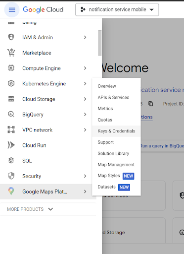
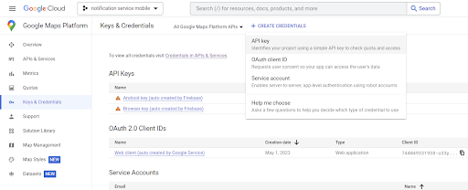
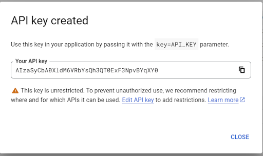
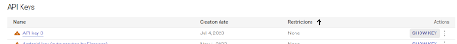
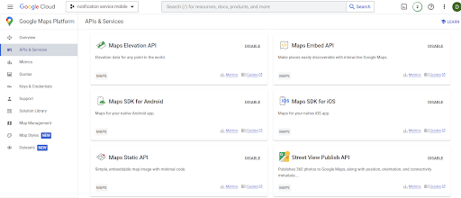

# GOOGLE MAPS APIS

### API KEY

1. Зарегистрироваться в [Google Cloud](https://console.cloud.google.com/welcome?project=notification-service-mobile).
2. В меню слева навести курсор на пункт Google Maps Platform, в появившемся меню выбрать Keys & Credentials:

   
3. Нажать на кнопку Create Credentials, появится список, из которого нужно выбрать API key:

   
4. После загрузки появится окно, где можно скопировать сгенерированный ключ, который нужен разработчику:

   

5. Также ключ появится в списке:

   

### MAP SDK Android/IOS

#### Перейти во вкладку API’s & Services, активировать нужные SDK:

   