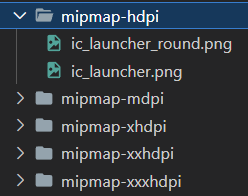
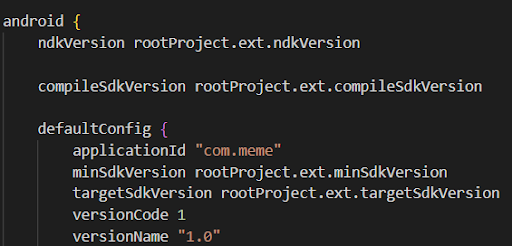

# Публикация в _Google Play Store_

### Шаг первый подготовить все необходимые файлы к публикации:

1. Файл приложения в формате abb (с обязательным апрувом от PM/QA):

- убедится, что приложение работает на реальном устройстве, собрав apk файл c помощью команд: cd android && ./gradlew assembleRelease (файл находится по пути {progect_name}/android/app/build/outputs/apk/release/app-release.apk);
- проверить, актуально ли название приложения по пути {progect_name}/android/app/src/main/res/values/strings.xml;
- Поменять иконку приложения, сгенерировав ее на сайте https://icon.kitchen/, или на других подобных. Менять иконки нужно по пути {progect_name}/android/app/src/main/res, указанные на изображении файлы:

 

- Если приложение уже публиковалось, проверить номер версии в файле название_приложения\android\app\build.gradle. Так же может потребоваться изменить applicationId, в плеймаркете не пропускает aab файл? если такой идентификатор уже был:

 

- Собрать проект в формате aab можно с помощью команд cd android && ./gradlew bundleRelease. Файл можно найти по пути {progect_name}/android/app/build/outputs/bundle/release/app-release.aab

2. Медиафайлы для Android ([видео инструкция](https://www.youtube.com/watch?v=q7NFn2Wfwxc)):

- Электронная почта которая будет доступна пользователям в маркете;
- Политика конфиденциальности должна быть доступна по внешней ссылке для любого пользователя;
- Название приложения <= 30 символов;
- Краткое описание 80 символов;
- Полное описание 4000 символов;
- Иконка: изображение в формате PNG (с прозрачным фоном) или JPEG и с разрешением 512 x 512 пкс. Размер файла – не более 1 МБ;
- Картинка для описания должна быть в формате PNG или JPEG и с разрешением 1024 x 500 пкс. Размер файла – не более 1 МБ;
- Скриншоты для смартфона от двух до восьми скриншотов для телефона. Выберите формат PNG или JPEG. Соотношение сторон изображения должно составлять 16:9 или 9:16, длина каждой стороны - от 320 до 3840 пкс. Размер одного файла – не более 8 МБ;
- (_не обязательно_) Скриншоты для семидюймовых планшетов до восьми скриншотов для 7-дюймовых планшетов. Выберите формат PNG или JPEG. Соотношение сторон изображения должно составлять 16:9 или 9:16, длина каждой стороны – от 320 до 3840 пкс. Размер одного файла – не более 8 МБж;
- (_не обязательно_) Скриншоты для 10-дюймового планшета до восьми скриншотов для 10-дюймовых планшетов. Выберите формат PNG или JPEG. Соотношение сторон изображения должно составлять 16:9 или 9:16, длина каждой стороны – от 320 до 3840 пкс. Размер одного файла – не более 8 МБ;
- (_не обязательно_) Видео, указав URL ролика на YouTube. Ролик должен быть горизонтальным, доступным для всех или по ссылке, без рекламы и возрастных ограничений.

### Шаг второй переходим в _Google Play Console_

1. Переходим во вкладку “Страница приложения” заполняем данные в основном из пункта 2 и сохраняем.
2. Переходим в вкладку “Рабочая версия” загружаем abb файл, пишем примечание к выпуску как пример (Незначительные обновления) - нажимаем “Проверить выпуск”.
3. После чего вверху страницы будут отображаться ошибки тапаем на них.
4. Отвечаем на вопросы честно как есть на самом деле (в большинстве случаем ответ “нет”) проходим все опросники которые нам предлагает гугл.

_
! Если приложение с ограниченным доступом или необходима авторизация, эти данные нужно указать и подробно описать, что нужно сделать что бы войти или воспользоваться каким то функционалом !
_