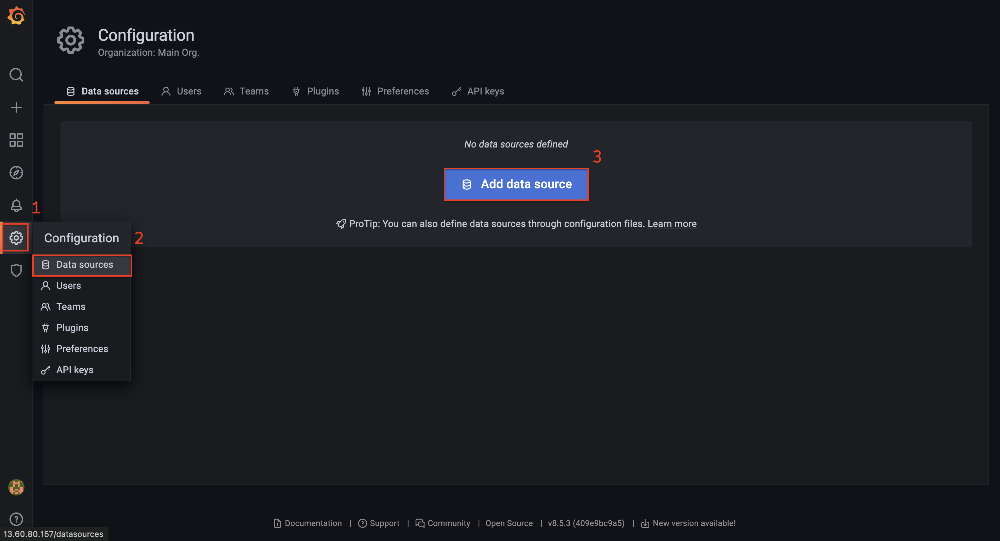
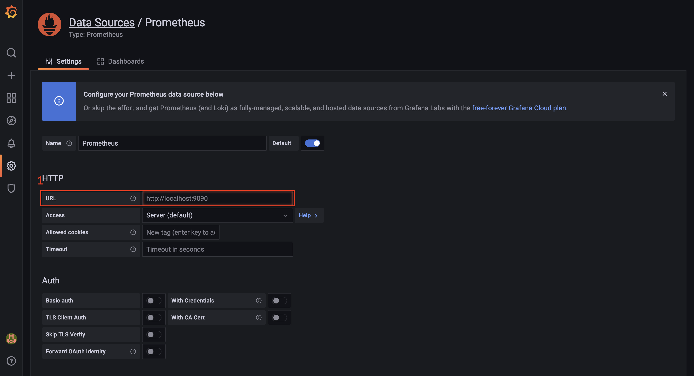
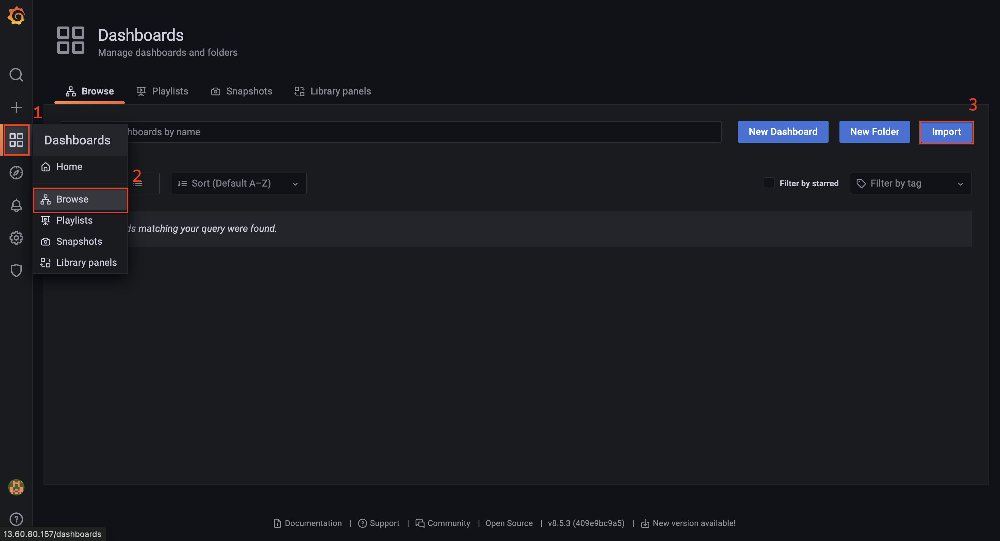
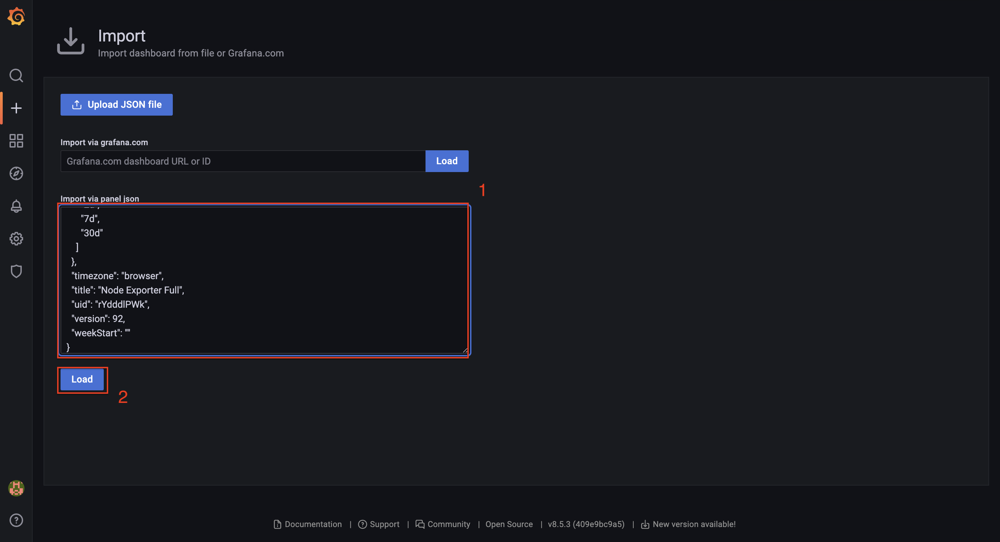
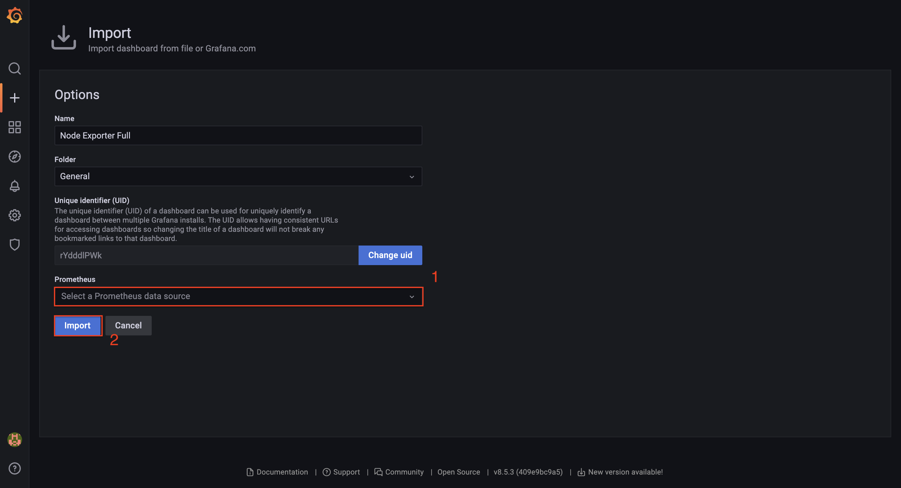

# Configuring and connecting Grafana metrics

## Server setup

##### 1. Go to the server and create a “monitoring” folder, then navigate to it..
```
mkdir monitoring
```
```
cd monitoring
```

##### 2. Download setup Grafana from [github](https://github.com/NLTDevelop/nltdev-grafana).
```
git clone ...
```


##### 3. Update dependencies and install Docker.
```
sudo apt update && sudo apt install docker.io
```


##### 4. Initializing Docker Swarm.
```
sudo docker swarm init
```


##### 5. Deploy the service stack in Docker Swarm using the Docker Compose file.
```
sudo docker stack deploy -c ~/monitoring/nltdev-grafana/docker-compose.yml monitoring
```


##### 6. Configure Nginx so that we can access Grafana.
```
sudo nano /etc/nginx/sites-available/monitoring-config
```

###### Insert this code:
```
server {

    listen 80;
    server_name your_domain;

    location / {
        proxy_pass http://localhost:13000;
        proxy_set_header Host $host;
        proxy_set_header X-Real-IP $remote_addr;
        proxy_set_header X-Forwarded-For $proxy_add_x_forwarded_for;
        proxy_set_header X-Forwarded-Proto $scheme;
    }

}
```
```
sudo ln -s /etc/nginx/sites-available/monitoring-config /etc/nginx/sites-enabled/
```
```
sudo nginx -t
```
```
sudo systemctl restart nginx
```


## Customizing Grafana and Prometheus.


##### 1. Go to your browser and log in to the Grafana application. (After authorization, change your password)
Url:
```
http://your_ip_server:80
```
Login:
```
admin
```
Password:
```
admin
```


##### 2. Connect Prometheus to Grafana.

###### Click on “Configuration” (hex), then on “Data sources” and then on “Add data source”. In the list select “Prometheus”:


###### In the “URL” field, enter the following address:
```
http://prometheus:9090
```


###### Click on the “Save & test” button.


##### 3. Configuring the Node Exporter in Grafana.

###### Go to the link, download the JSON and copy the content. [Node Exporter Full](https://grafana.com/grafana/dashboards/1860-node-exporter-full/)

###### In the Grafana app, click on “Dashboards” (4 crudates), then on “Browse” and then on “Import”:


###### In the “Import via panel json” field, paste the previously copied JSON and click “Load”:


###### In the “Prometheus” field, select “Prometheus (default)” and click “import”.



##### 4. Configure the Node Exporter on the server.

###### Open the file “prometheus.yml”:
```
sudo nano /var/lib/docker/volumes/monitoring_prom-configs/_data/prometheus.yml
```

###### At the end of the file insert this code:
```
  - job_name: "node-exporter"

    static_configs:
      - targets: ["node-exporter:9100"]
```

###### Restarting the Prometheus condinet in Docker:
```
sudo docker ps
```
```
sudo docker restart your_container_id
```

###### Done, but may need to wait a while (2-5 min.).