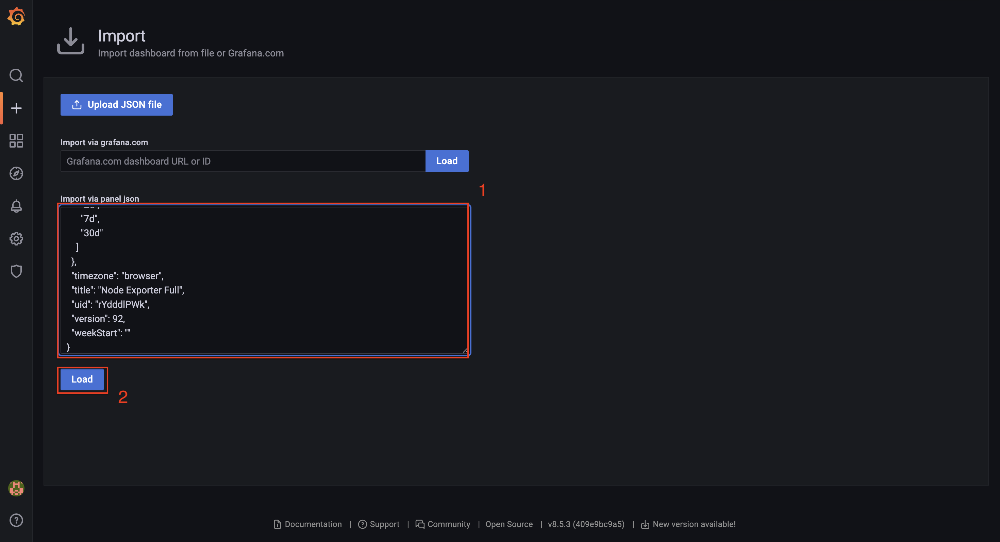

# Configuring and connecting Grafana logger and metric

## Server setup

##### 1. Go to the server and create a “monitoring” folder, then navigate to it..
```
mkdir monitoring
```
```
cd monitoring
```

##### 2. Download setup Grafana from [github](https://github.com/NLTDevelop/nltdev-grafana).
```
git clone ...
```


##### 3. Update dependencies and install Docker (Drop this step if docker already installed).

##### - install dependencies
```
sudo apt update
sudo apt install apt-transport-https ca-certificates curl software-properties-common
curl -fsSL https://download.docker.com/linux/ubuntu/gpg | sudo gpg --dearmor -o /usr/share/keyrings/docker-archive-keyring.gpg
echo "deb [arch=amd64 signed-by=/usr/share/keyrings/docker-archive-keyring.gpg] https://download.docker.com/linux/ubuntu $(lsb_release -cs) stable" | sudo tee /etc/apt/sources.list.d/docker.list > /dev/null
```
##### - install docker
```
sudo apt update
sudo apt install docker-ce docker-ce-cli containerd.io
```
##### - check if docker works:
```
sudo systemctl status docker
```


##### 4. Initializing Docker Compose.
```
sudo curl -L "https://github.com/docker/compose/releases/download/$(curl -s https://api.github.com/repos/docker/compose/releases/latest | jq -r .tag_name)/docker-compose-$(uname -s)-$(uname -m)" -o /usr/local/bin/docker-compose
```

##### 5. Check version, update roots and run docker.
##### - check version and if docker-compose is available
```
sudo docker-compose --version
```

##### - update roots
```
sudo chmod +x /usr/local/bin/docker-compose
```

##### - run docker
```
sudo docker-compose -f ~/monitoring/nltdev-grafana/docker-compose.yml up -d
```

##### - If you want to see logs:
```
sudo docker-compose -f ~/monitoring/nltdev-grafana/docker-compose.yml logs

or remove a flag -d when run docker that fall into logs of docker
```

##### 6. Configure Nginx so that we can access Grafana.
```
sudo nano /etc/nginx/sites-available/monitoring-config
```

###### Insert this code:
```
server {

    listen 80;
    server_name your_domain;

    location / {
        proxy_pass http://localhost:13000;
        proxy_set_header Host $host;
        proxy_set_header X-Real-IP $remote_addr;
        proxy_set_header X-Forwarded-For $proxy_add_x_forwarded_for;
        proxy_set_header X-Forwarded-Proto $scheme;
    }

}
```
```
sudo ln -s /etc/nginx/sites-available/monitoring-config /etc/nginx/sites-enabled/
```
```
sudo nginx -t
```
```
sudo systemctl restart nginx
```


## Customizing Grafana Prometheus.


##### 1. Go to your browser and log in to the Grafana application. (After authorization, change your password)
Url:
```
http://your_ip_server:80
```
Login:
```
admin
```
Password:
```
admin
```


##### 2. Connect Prometheus to Grafana.

###### Click on “Connections”, then on “Data sources” and then on “Add data source”. In the list select “Prometheus”:


###### In the “URL” field, enter the following address:
```
http://prometheus:9090
```


###### Click on the “Save & test” button.


##### 3. Configuring the Node Exporter in Grafana.

###### Go to the link, download the JSON and copy the content. [Node Exporter Full](https://grafana.com/grafana/dashboards/1860-node-exporter-full/)

###### In the Grafana app, click on “Dashboards” (4 crudates), then on "New", then on “Import”(Or drag and drop your downloaded json file):


###### In the “Import via panel json” field, paste the previously copied JSON and click “Load”:


###### In the “Prometheus” field, select “Prometheus (default)” and click “import”.


###### Done, but may need to wait a while (2-5 min.).

##### 4. Connect Grafana Loki.
###### Click on “Connections”, then on “Data sources” and then on “Add data source”. In the list select “Loki”:


###### In the “URL” field, enter the following address:
```
http://loki:3131
```


###### Click on the “Save & test” button bellow of page.

###### Now you can see your logs in "Explore" -> "Logs"

## Customizing your NestJS project.
###### 1. In the beginning install the loki logger packages in your project
```
npm i nestjs-loki-logger
```

###### 2. Now your LoggerModule should gettings new imports LokiLoggerModule
```TypeScript
@Global()
@Module({
  imports: [
    SequelizeModule.forFeature([Log]), 
    LokiLoggerModule.forRoot({
      lokiUrl: 'http://127.0.0.1:3131', // :3131 your port of loki instanse
      labels: {
        app: 'nestjs', // lable of your app
      },
      logToConsole: false, // if you want to send lo to console change to true
      onLokiError: e => console.error(e),
      gzip: false,
    }),
  ],
  controllers: [LoggerController],
  providers: [LoggerService],
  exports: [LoggerService],
})
export class LoggerModule {}
```

###### 3. Setup your LoggerServie
```TypeScript
export class LoggerService {

  private readonly lokiLogger = new LokiLogger('nestjs');

  info(context: string, data?: Record<string, any>) {
    const logEntryString = JSON.stringify(data);
    return this.lokiLogger.log(logEntryString, 'nestjs');
  }

  warn(context: string, data?: Record<string, any>) {
    const logEntryString = JSON.stringify(data);
    return this.lokiLogger.warn(logEntryString, 'nestjs');
  }

  error(context: string, data?: Record<string, any>) {
    const logEntryString = JSON.stringify(data);
    return this.lokiLogger.error(logEntryString, 'nestjs');
  }
}

// The logs have three methods:
// error, warn, log(message: string, context?: string, labels?: Record<string, string>,): void
// wehere: 
// - message -> your data of log
// - context -> your context in which you can specify from which part of the application or from which module the log was sent (Or your can set undefind)
// - labels -> add custom labels for logs that we can do specific search if it`s neccesary. Like exapmple { label: 'loki log'}
```

###### 4. Example of usage
```TypeScript
@Injectable()
export class LoggerMiddleware implements NestMiddleware {
  constructor(private readonly logger: LoggerService) {}

  // send log based on status
  private logBasedOnStatus(status: number, message: string, data: Record<string, any>) {
    if (status >= 400) {
      this.logger.error(message, data);
    } else {
      this.logger.info(message, data);
    }
  }

  // hide password (Or any secure data) if your doesn't want that this data will be dropped to third persons
  private sanitizeBody(body: any): any {
    if (body && typeof body === 'object') {
      if (body.password) {
        body.password = '***';
      }

      Object.keys(body).forEach(key => {
        if (typeof body[key] === 'object') {
          body[key] = this.sanitizeBody(body[key]);
        }
      });
    }

    return body;
  }

  use(req: Request, res: Response, next: NextFunction) {
    // you can add logic that will be not send log to loki logger if you wish
    // if (condition) {
    //  return next();
    //}
    
    // in below you can specific and change your logs as different as you want
    const logEntry = {
      timestamp: new Date().toISOString(),
      method: req.method,
      url: req.originalUrl,
      headers: req.headers,
      body: req.body || null,
    };

    const originalSend = res.send.bind(res);
    let responseBody: any;
    res.send = (chunk: any) => {
      try {
        responseBody = JSON.parse(chunk);
      } catch {
        responseBody = chunk;
      }

      const sanitizedBody = this.sanitizeBody(logEntry.body);
      const logEntryWithBody = { ...logEntry, body: sanitizedBody };

      const fullLogEntry = {
        ...logEntryWithBody,
        status: res.statusCode,
        response: responseBody,
      };

      this.logBasedOnStatus(res.statusCode, 'http request', fullLogEntry);

      return originalSend(chunk);
    };

    next();
  }
}
```

```TypeScript
export class AppModule implements NestModule {
  configure(consumer: MiddlewareConsumer) {
    // add your middleware to your app module
    consumer.apply(LoggerMiddleware).forRoutes(':splat*');
  }
}
```

###### Done. That`s ease to check your logs. Go to the Grafana Logs and you will be see your logs

