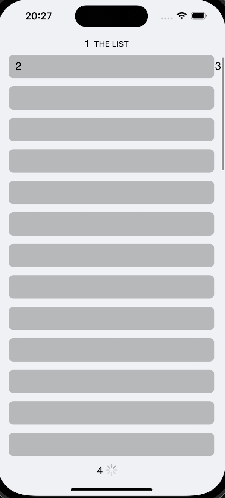

# Списки в мобильных приложениях # 

### Содержание

1. Основные составляющие списка.
2. Пагинация.
3. Lazy Loading.
3. Обновление списка (Pull to refresh).

### Основные составляющие списка

1. Herader
   * можно сделать статичным или листать вместе со списком.

2. Item
    * элемент списка;
    * по возможности высота должна быть фиксированой;
    * чем проще, тем лучше.

3. Scroll indicator
    * отображает позицию скрола;
    * в некоторых случаях стоит скрывать, например когда пользователю не важна позиция, список не предпологает конца (лента инстаграмма, главная страница ютуба и т. д.).

4. Footer
    * нижний компонент списка, может быть лоадер загрузки новых элементов, как на примере.

### Пагинация

Постраничная навигация (пейджинг или пагинация) — способ представления большого количества однородной информации, когда контент разбивается на страницы.

Отрисовка большого количества элементов списка ведет к большим нагрузкаи и может происходить долго. Для исправления этой проблемы стоит запрашивать элементы страницами. Как правило, в мобильных приложениях при достижении конца списка мы запришиваем следующую страницу до тех пор, пока есть что запрашивать. Так же этот процесс можно сделать более незаметным для пользователя использовав lazy loading.

### Lazy Loading
Это стратегия, направленная на определение ресурсов как неблокирующих (не критических) для того, чтобы отложить загрузку этих ресурсов на тот момент, когда они действительно необходимы. Так можно сократить длину критических этапов рендеринга, что приводит к уменьшению времени загрузки приложения.

Ленивая загрузка может происходить в разные моменты работы приложения, но, как правило, она запускается во время взаимодействия пользователя и системы, например, при скроллинге или навигации.

### Обновление списка (Pull to refresh)

Функция Pull to refresh позоляет пользователю самостоятельно обновить список с помошью жеста. Стоит ее использовать, когда данные не должны обновлятся автоматически, как в новосной ленте или в списоке товаров. Не стоит использовать, если список обновляется автоматически, например, чаты или уведомления.