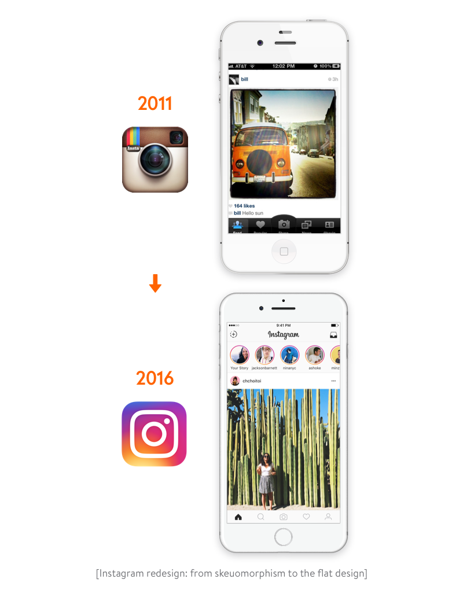

# MOBILE_APP_VERSIONING #

For our applications, we use the __Semantic Versioning (SemVer)__ pattern.

According to SemVer, you should version your product with three decimal-delimited digits (1.10.32).
Following the pattern __[major].[minor].[patch]__. When it comes to incrementing each digit, you increment the:

- Increment Major version when new features are added in a way that significantly changes how the product looks and operates from the point of view of the user. Often used for massive UI/UX updates

- Increment Minor version when new features are added, but without changing the core concept or fundamentals of the product.

- Increment Patch version when you ship releases containing bug fixes for existing features.

For pre-release, unofficial versions that exist during development and have not yet been released, use a major number less than 1, such as (0.24.1)

>Always when changing the high number, the low one is reset to zero!

### Examples ###
1. After the project is fully configured, we have the application version 0.0.1.
2. We add some feature to our application, for example, an authorization page, the application version becomes 0.1.0
3. The tester found a bug and after fixing the build version is 0.1.1
4. So we developed our application and now the application version is 0.34.1, it's time to upload it to the stores, we check the code, clean up the code that we used during development, and compile the build with version 1.0.0
5. The application has been in the stores for a long time and its version is now 1.12.2, we decided to redesign the entire application (as in the picture below) or rewrite its main functionality (for example, the application is tied to photo processing and the photo editor was replaced with another one), in which case you can change major version 2.0.0

