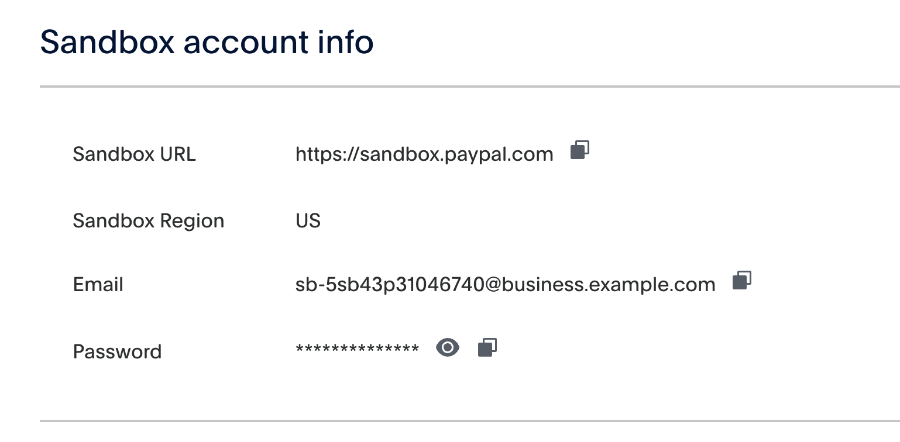
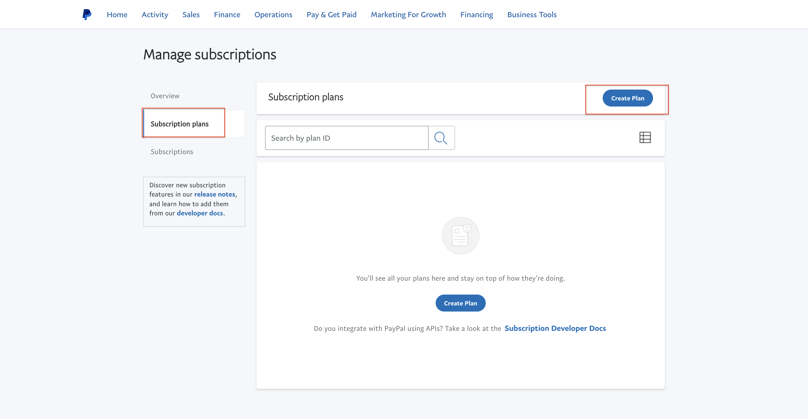

## The first thing we will often work with is the [dashboard](https://developer.paypal.com/dashboard/)

## There is a sample code in Skeleton

# 1.PayPal setup and connections
After registration we need to create an application and two test accounts.
To create accounts follow this [link](https://developer.paypal.com/dashboard/accounts).

Create two accounts Business and Personal.

To create an application go to this [link](https://developer.paypal.com/dashboard/applications/sandbox) and do the following actions

Here we need to select the test business account that we created earlier.

After we have created the application we can go to it and see the link and account for creating products and plans.

Also here are the keys to connect the paypal app to our app.

and here we can customize and create endpoint for webhooks.

we can subscribe to all events or select specific ones.

# 1.Subscribe
To create a subscription we need to follow the link that is in our application and authorize under the business account.

After authorization we need to do these steps to go to the product creation.

Then we go to create a plan

and then you will be offered to create a product.

When creating a product in the product type field you need to specify "Service".
Next to create a fee you need to specify

and you can choose the regularity of subscription, as well as choose trial period, unlike stripe for the logic of working with trial period I created two plans, one with trial, the second without, because in paypal you can not specify trial period when creating a subscription for the user.

After creating a plan for subscription you will get all ids (product, plan) to work with them in the application.

# 3.Webhooks
To work with webhooks in the application you need to create a request to which paypal will be
knock paypal. The request must be POST and accept rawBody, also it is necessary to validate webhooks that come in

This is how the request for webhooks looks like

We can work with webhooks by clicking on the following [link](https://developer.paypal.com/dashboard/webhooks/sandbox)

Here we can see what events are knocking on our door and what is coming to us.

Further work with them is to listen to some event and perform some logic when this event is executed.