## The first thing we will often work with is the [dashboard ](https://dashboard.stripe.com/test/dashboard)

## There is a sample code in Skeleton

## Test card 4242 4242 4242 4242 4242 4242

# 1.Setting up Stripe
First we need to create our application in stripe, follow this [link](https://dashboard.stripe.com/test/dashboard) and create an application(account) .
You may be prompted to create it at the beginning or we can create it ourselves.
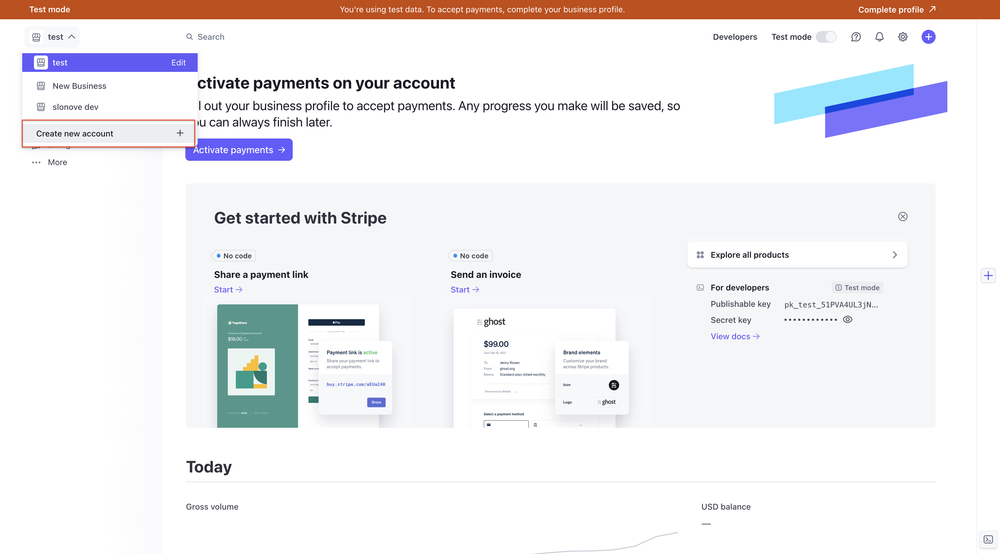

After creating the application in stripe we need to get the keys to connect it to our application

Go to the tab Developers => API keys, there is a secret key that we need to insert into our application.
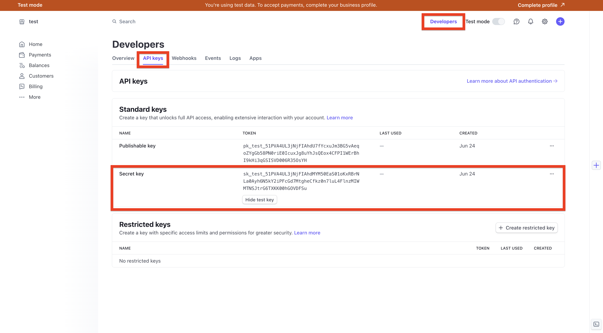

Once we have the secret key, we need to get another key for webhooks, but first we need to create an endpoint.

To create it we need to go to Developers => Webhooks
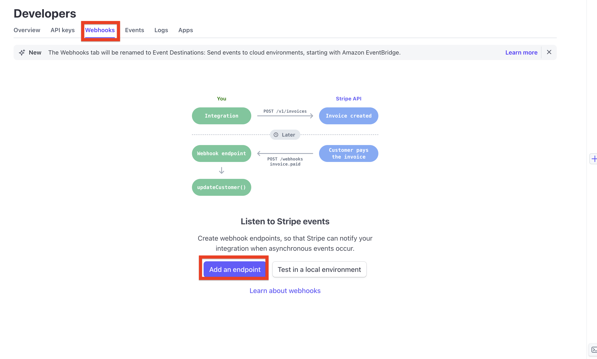

then create endpoint.
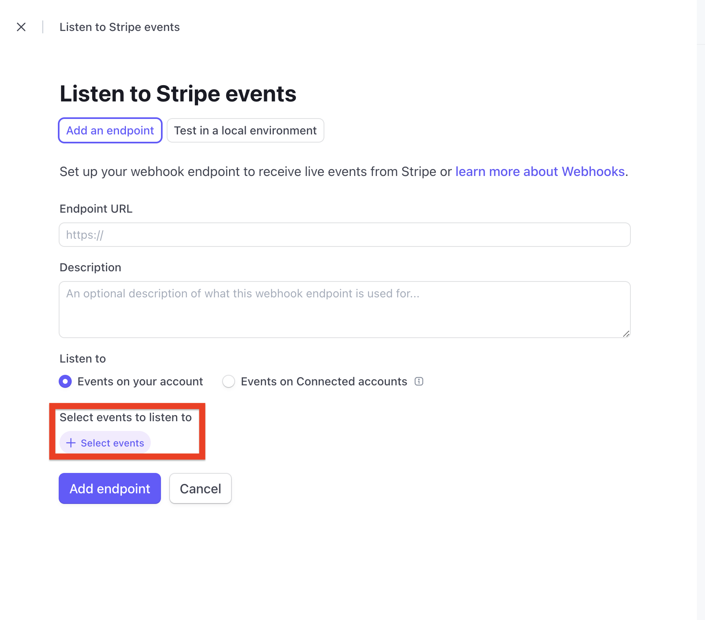

When creating the endpoint we need to select which events it will subscribe to, we can subscribe to all events.
After creation we can go to our endpoint and get the key.
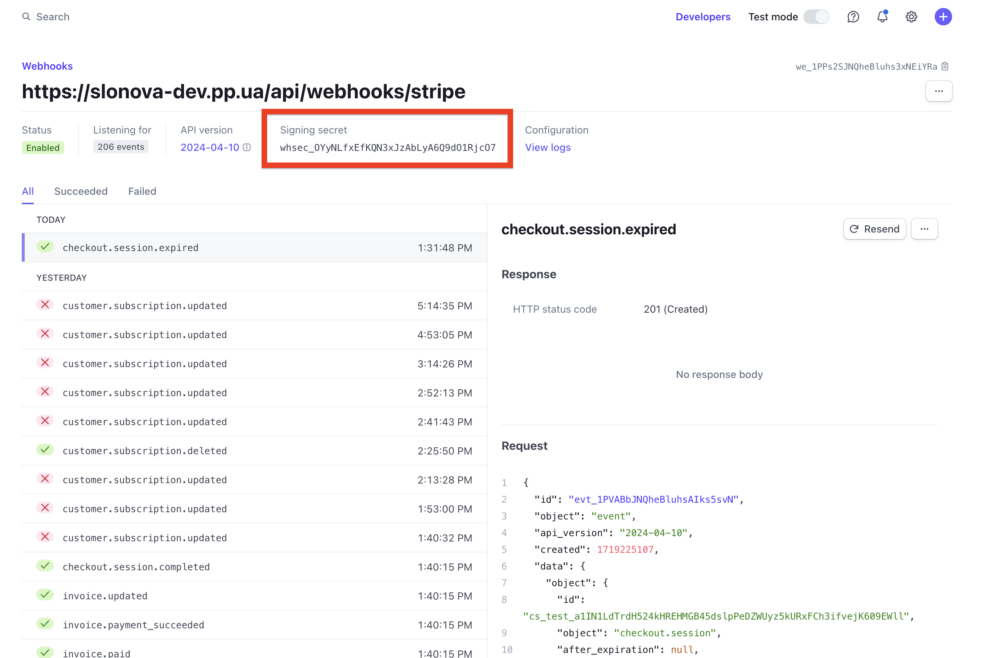

# 2. Products
Go to the products catalog and here we can see all our products, here we can edit it or create it.
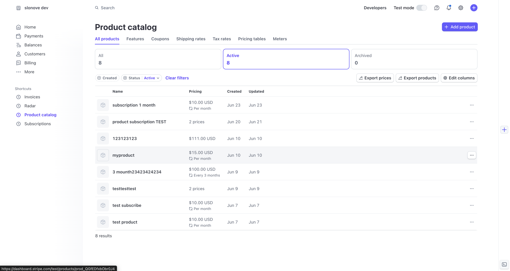

When creating a product we can specify a plan, it can be either a regular product or a subscription. When we create a product with a subscription we can specify its period (monthly subscription, etc.).
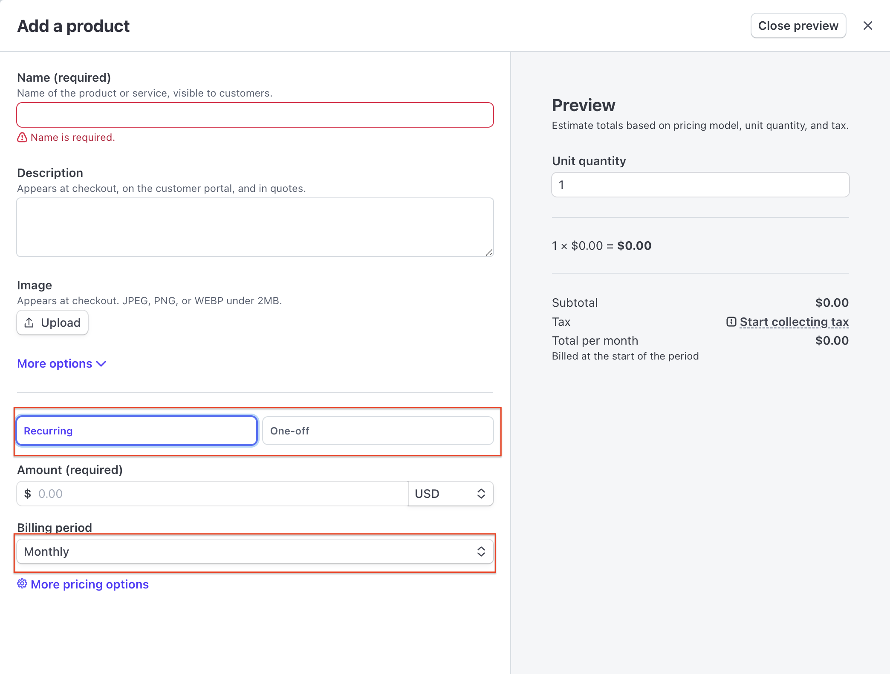

Also if we need to create a subscription with a trial period, it is done through code.

In this example we are creating a user subscription with trial period.

When a user makes their first purchase in the app, we need to create them in the customer stripe so that we can track their actions related to products.

In Stripe we have a tab called [Customers](https://dashboard.stripe.com/test/customers) where we can see all our users. By clicking on a user we can see all his purchases and subscriptions.
In the detailed user we can cancel subscriptions, edit the period, etc.
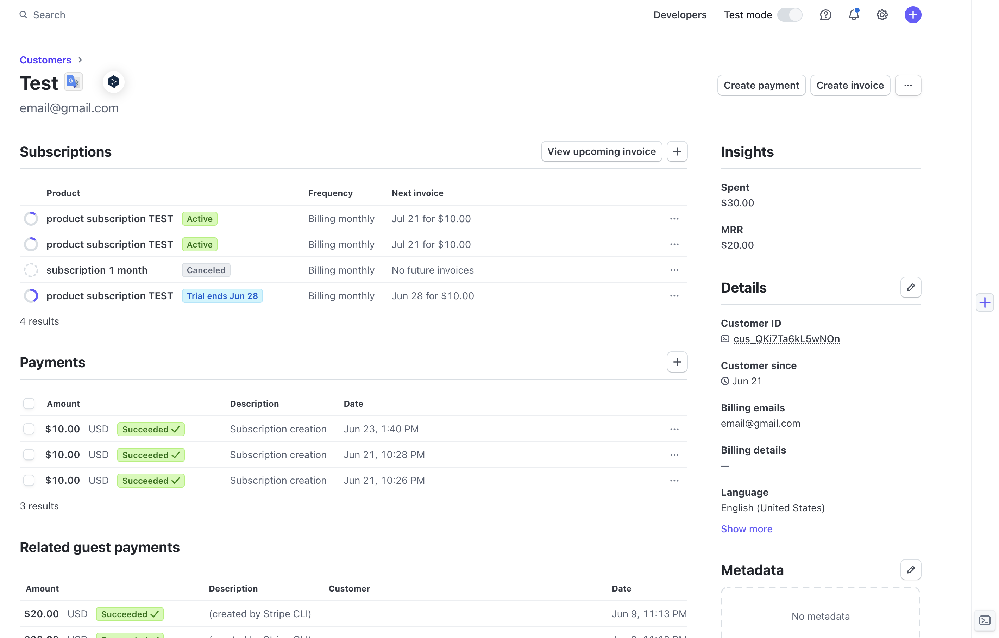

# 3. webhooks
To work with webhooks in the application we need to create a request to which will be
stripe. The request must be POST and accept rawBody, also it is necessary to validate webhooks that come in.
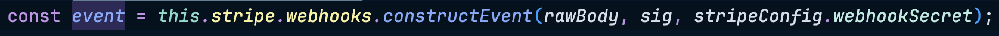

This is how the request for webhooks looks like
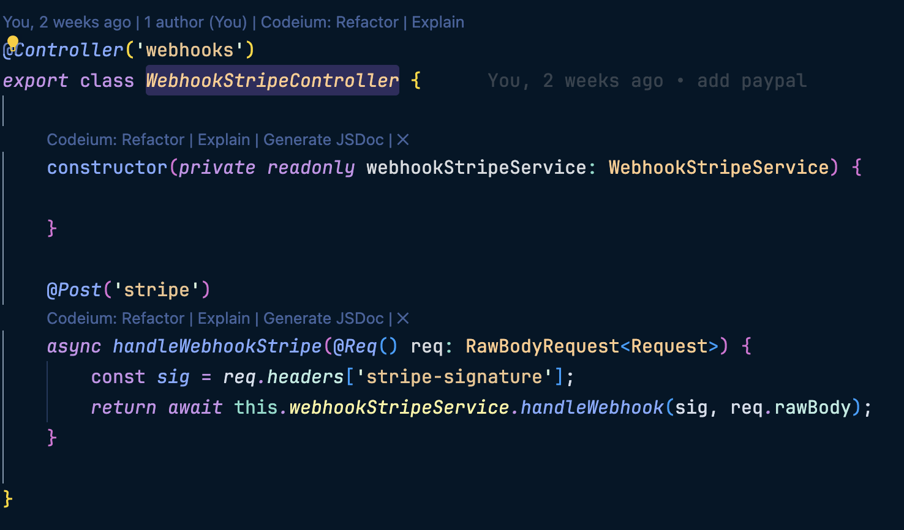

We can work with webhooks in the webhooks tab.
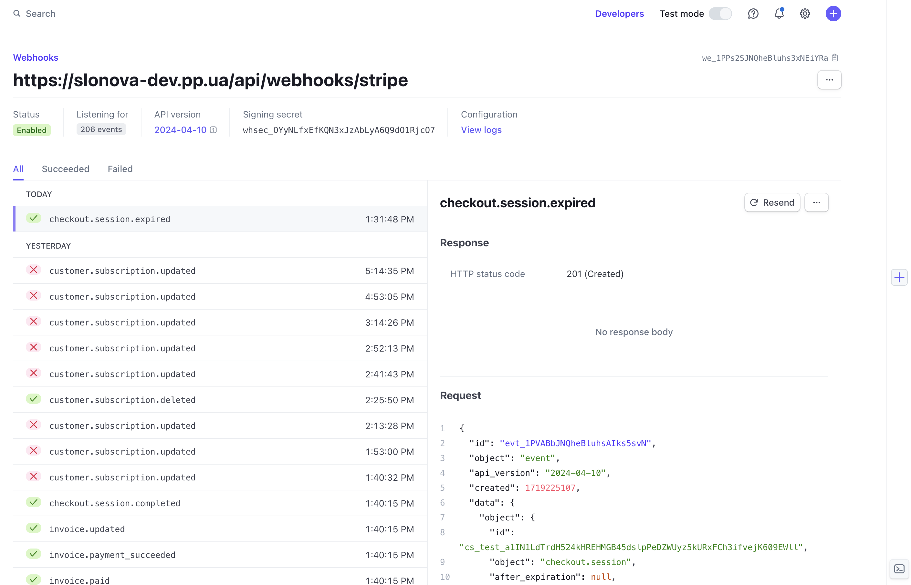

Here we can see what events are knocking on our door and what is coming to us.

Further work with them is to listen to some event and perform some logic when this event is executed.