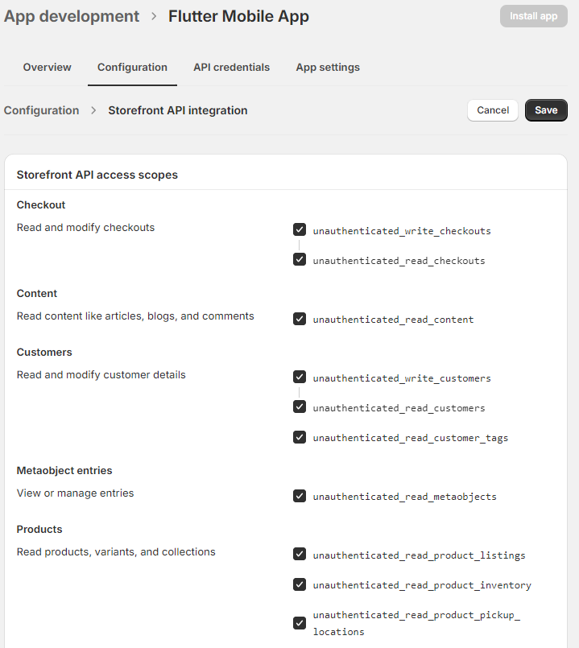
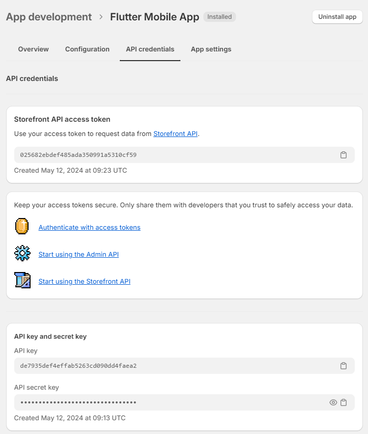

# Создание приложений при помощи Shopify

**Shopify** - сервис, который позволяет развертывать сайт и его серверную часть без каких-то сложностей со стороны владельца тех или иных товаров/услуг. В данном случае, нас интересует взаимодействие сервиса со сторонними приложениями и способы развертывания мобильного приложение, используя данные магазина, т.е. создание своей мобильной реализации магазина.

## Создание аккаунта

Первоочередной задачей для взаимодействия с сервисом необходимо [создать на странице партнеров](https://partners.shopify.com/signup/developer) аккаунт. Проходим небольшую регистрацию с данными, для чего нам необходим аккаунт.

## Создание магазина

После того, как мы зарегистрировались, нам необходимо создать магазин для разработки или получить доступ к уже существующему. В этой документации мы рассмотрим создание с нуля. Для этого переходим в раздел **Stores** и нажимаем на кнопку **Create a development store**.

После чего нам предоставляется 2 варианта. В первом есть возможность передачи созданного аккаунта, а другой необходим для тестирования нового функционала и возможностей. Для второго, так же есть возможность получить получить моковые данные по умолчанию.

Далее переходим в тему, и инициализируем понравившеюся нам тему. После того, как пройдет инициализация, мы можем просмотреть результат через **View your store**.

## Как подключить авторизацию

Чтобы добавить авторизацию пользователей, необходимо перейти в настройки, которые мы можем найти в нижнем левом углу.

Затем перейти в раздел **Customer accounts** и **Account in online store and checkout** добавить галочку в **Show login link in the header of online store and at checkout**, сохранить изменения. Теперь в нашем макете есть доступ к авторизации пользователей.

## Как создать стороннее приложение с данными от Вашего магазина

Для того, чтобы создать приложение с данными магазина, необходимо перейти в **Settings - Apps and Sales Channels**. Далее нажимаем **Allow custom app development**. В новом окне мы соглашаемся с тем, что разработчик может взаимодействовать с приложением. Нажимаем снова **Allow custom app development**.

Затем нажимаем кнопку **Create an app**.

После этого вводим название приложения для удобного поиска его среди других реализаций.

Чтобы реализовать мобильную версию сайта необходимо нажать в разделе **Overview - Select your access scopes to get starter** кнопку **Configure Storefront API scopes**.

В появившемся окне даем все необходимые разрешения, сохраняем изменения и нажимаем теперь уже активную кнопку **Install app**, где мы подтверждаем создание приложения.

Затем нас перебрасывает на окно с токенами, которые необходимы для взаимодействия приложения и наших данных.

Ключ, который расположен в **Storefront API access token** необходимо будет передавать в хедере
**X-Shopify-Storefront-Access-Token**.

А хостом будет тот же самый хост, что и у сайта:

`https://smarthelperdev.myshopify.com/api/2024-04/graphql.json`,

где 2024-04 - версия API. Какие бывают версии можно посмотреть в [документации](https://shopify.dev/docs/api/storefront).

Все в той же статье, в разделе **Endpoints and queries** можем увидеть ссылку на приложение для построения графов.

Даем ссылку на наш сайт, даем необходимые разрешения и подтверждаем создание.

Затем снова подтверждаем все разрешения и нажимаем кнопку **install**.

Теперь нам доступно приложение через которое можем получать данные и запросы магазина и использовать их в нашем приложении. Рекомендую закрепить данное приложение в меню слева.

